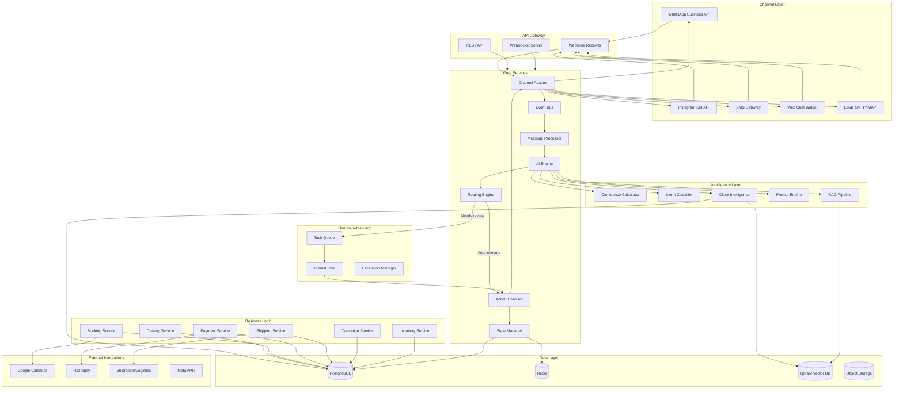
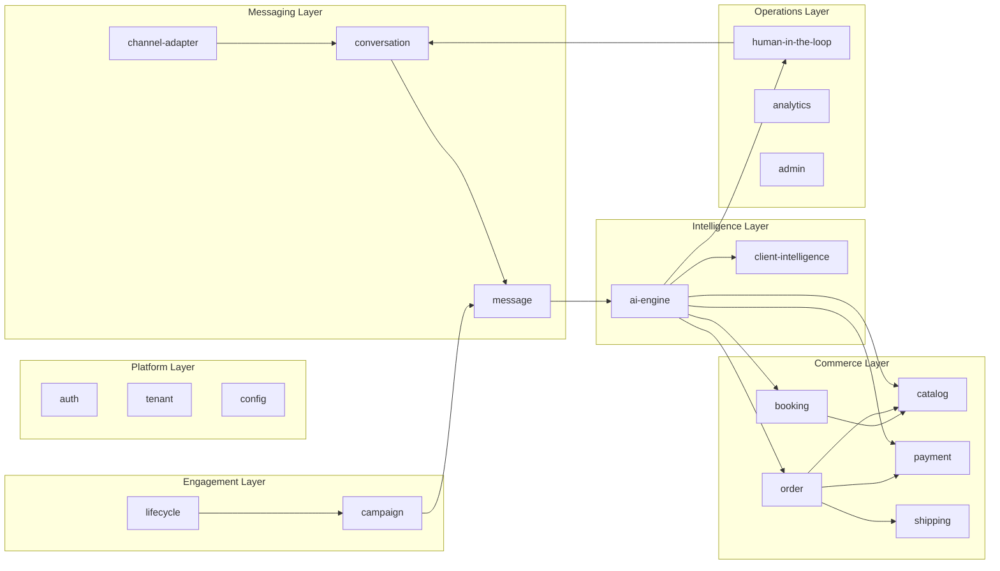
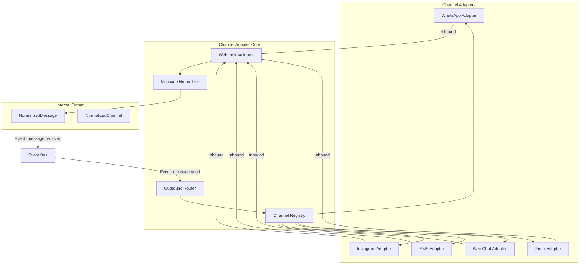
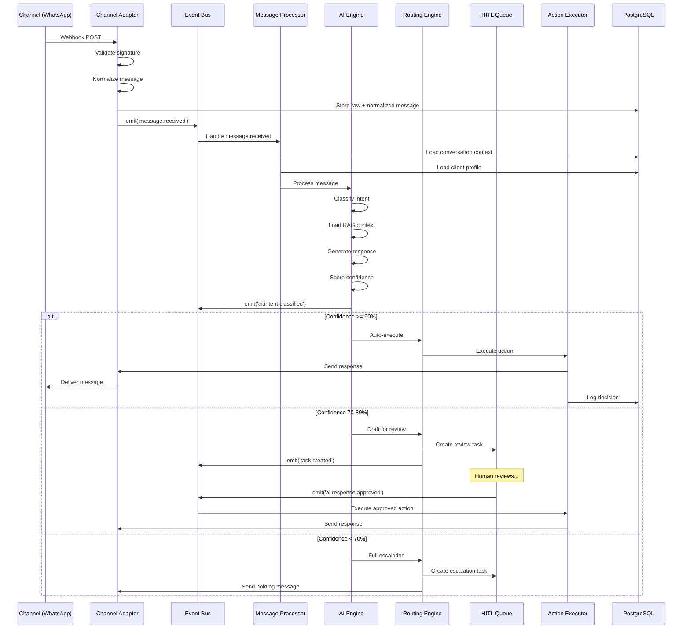
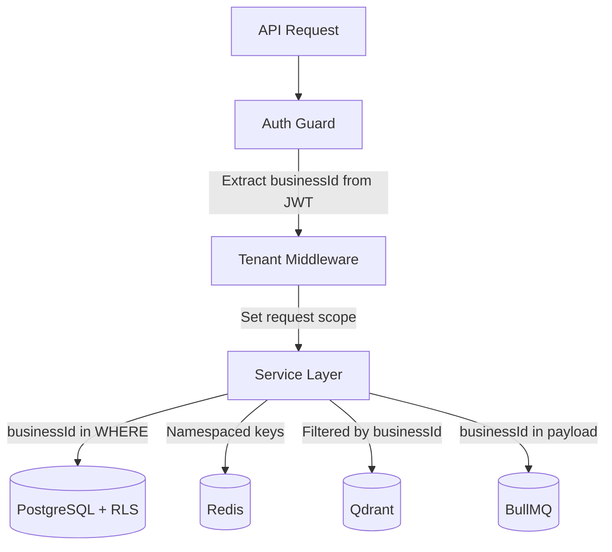
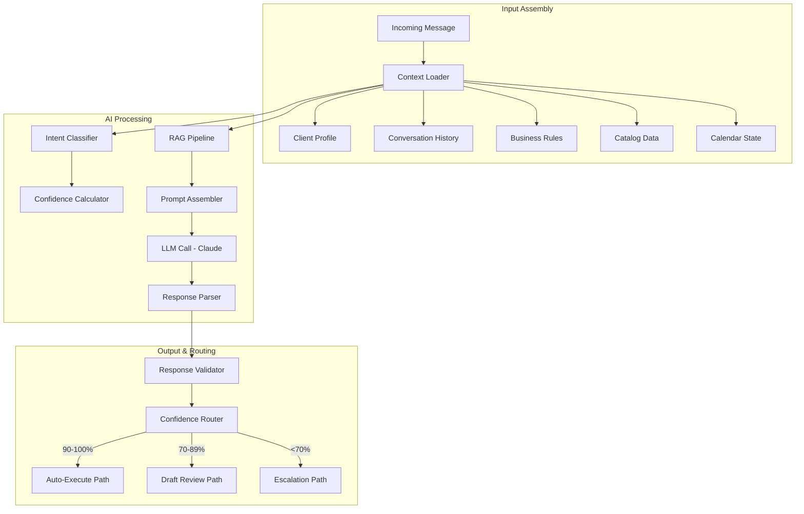
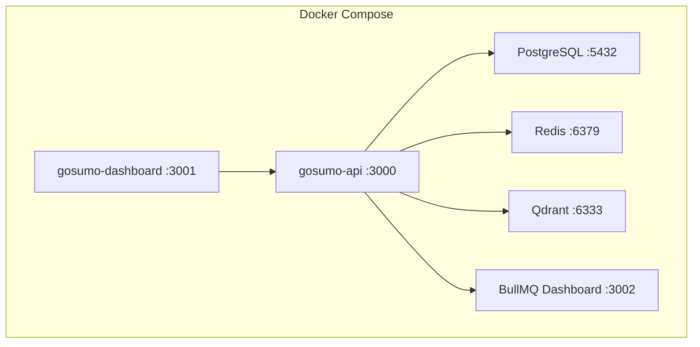
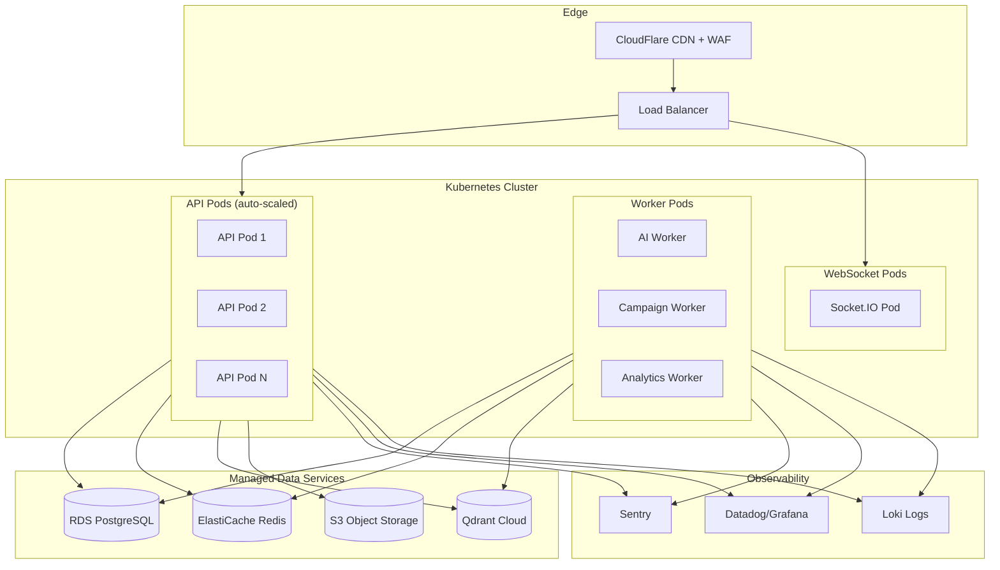

# GoSumo — System Architecture

> AI-powered client management platform for small businesses in emerging markets.
> **Design Principle:** Channel-agnostic, AI-agent-developed, event-driven, multi-tenant.

---

## 1. Architecture Overview

GoSumo is a **channel-agnostic AI operating layer** where customers communicate through any messaging channel, AI reasons and decides, connected systems execute actions, and humans intervene only when required.

### Core Processing Loop

```
Message In → Channel Adapter → Normalize → Event Bus → AI Pipeline → Route → Execute → Message Out
```

Every incoming message flows through the same pipeline regardless of source channel (WhatsApp, Instagram DM, SMS, Web Chat, Email). The system uses an **event-driven architecture** where each stage emits domain events consumed by downstream processors.

### Key Architectural Decisions

| Decision | Choice | Rationale |
|---|---|---|
| Monorepo tool | Turborepo + pnpm | Fast builds, caching, simpler than Nx for this scale |
| Backend framework | NestJS (TypeScript strict) | Module system maps 1:1 to domain boundaries, built-in DI, guards, interceptors |
| Primary DB | PostgreSQL 16 | JSONB for flexible schemas, row-level security for multi-tenancy, mature ecosystem |
| Cache / Queue broker | Redis 7 | BullMQ job queues, session cache, pub/sub for real-time |
| Vector store | Qdrant | Self-hostable, fast, good filtering for RAG |
| AI provider | Anthropic Claude (primary) | Best reasoning for complex business decisions |
| Frontend | Next.js 14 + React | SSR for dashboard, API routes for BFF |
| Real-time | Socket.IO | Dashboard live updates, typing indicators |
| Container orchestration | Docker Compose (dev), K8s (prod) | Local simplicity, production scalability |

---

## 2. High-Level System Diagram



---

## 3. Module Boundary Map

The system is organized into **13 bounded modules**, each independently deployable and testable. Every module has a single owner, clear public interface, and its own CLAUDE.md for AI agent context.



### Module Dependency Rules

1. **No circular dependencies.** If module A imports from B, B cannot import from A.
2. **Shared types live in `@gosumo/shared`.** DTOs, events, enums, and interfaces shared across modules.
3. **Each module exposes only its public API** via an `index.ts` barrel export.
4. **Cross-module communication** uses the Event Bus (domain events) for async flows and direct service injection for sync queries.
5. **Database access** is scoped per module — each module owns its tables and exposes data via service methods, never raw queries.

---

## 4. Module Inventory

| Module | Package | Responsibility | Key Dependencies |
|---|---|---|---|
| `channel-adapter` | `@gosumo/channel-adapter` | Normalize inbound/outbound messages across all channels | Redis, channel SDKs |
| `conversation` | `@gosumo/conversation` | Manage conversation lifecycle, state machine | PostgreSQL, Redis |
| `message` | `@gosumo/message` | Store, retrieve, search messages | PostgreSQL |
| `ai-engine` | `@gosumo/ai-engine` | Intent classification, confidence scoring, response generation | Anthropic SDK, Qdrant, Redis |
| `client-intelligence` | `@gosumo/client-intelligence` | Profile building, sentiment, churn scoring, LTV | PostgreSQL, Qdrant |
| `catalog` | `@gosumo/catalog` | Products, services, variants, pricing | PostgreSQL |
| `booking` | `@gosumo/booking` | Appointment scheduling, calendar sync | PostgreSQL, Google Calendar API |
| `payment` | `@gosumo/payment` | Payment links, webhooks, refunds, COD | Razorpay SDK, PostgreSQL |
| `order` | `@gosumo/order` | Order lifecycle, fulfillment coordination | PostgreSQL |
| `shipping` | `@gosumo/shipping` | Logistics provider abstraction, tracking | Shiprocket SDK, PostgreSQL |
| `campaign` | `@gosumo/campaign` | Promotional messaging, lifecycle campaigns | BullMQ, PostgreSQL |
| `human-in-the-loop` | `@gosumo/hitl` | Task queue, escalation, internal chat, approval workflows | PostgreSQL, Redis, Socket.IO |
| `auth` | `@gosumo/auth` | Authentication, RBAC, JWT, 2FA | PostgreSQL, Redis |
| `tenant` | `@gosumo/tenant` | Business profile, onboarding, settings | PostgreSQL |
| `analytics` | `@gosumo/analytics` | Metrics, reporting, autonomy KPIs | PostgreSQL, Redis |
| `admin` | `@gosumo/admin` | GoSumo internal admin dashboard backend | PostgreSQL |
| `shared` | `@gosumo/shared` | DTOs, events, enums, interfaces, utilities | None |

---

## 5. Channel Adapter Architecture

The Channel Adapter is the cornerstone of GoSumo's platform-agnostic design. It translates between channel-specific protocols and GoSumo's internal normalized message format.



### Normalized Message Interface

```typescript
interface NormalizedMessage {
  id: string;                          // GoSumo internal ID
  externalId: string;                  // Channel-specific message ID
  channel: ChannelType;                // WHATSAPP | INSTAGRAM | SMS | WEB_CHAT | EMAIL
  channelAccountId: string;            // Business's account on that channel
  direction: 'INBOUND' | 'OUTBOUND';
  sender: {
    externalId: string;                // Phone number, IG user ID, email, etc.
    displayName?: string;
  };
  content: MessageContent;             // Polymorphic content
  timestamp: Date;
  metadata: Record<string, unknown>;   // Channel-specific extras
}

type MessageContent =
  | { type: 'TEXT'; text: string }
  | { type: 'IMAGE'; url: string; caption?: string; mimeType: string }
  | { type: 'DOCUMENT'; url: string; filename: string; mimeType: string }
  | { type: 'LOCATION'; latitude: number; longitude: number; name?: string }
  | { type: 'INTERACTIVE'; interactiveType: string; payload: Record<string, unknown> }
  | { type: 'PAYMENT_LINK'; url: string; amount: number; currency: string }
  | { type: 'TEMPLATE'; templateName: string; parameters: Record<string, string> };
```

### Adding a New Channel

Adding a new channel requires implementing one interface:

```typescript
interface ChannelAdapter {
  readonly channelType: ChannelType;

  // Webhook handling
  validateWebhook(req: RawRequest): boolean;
  parseInbound(req: RawRequest): NormalizedMessage;

  // Outbound
  sendMessage(message: OutboundMessage): Promise<SendResult>;
  sendTemplate(template: TemplateMessage): Promise<SendResult>;
  sendInteractive(interactive: InteractiveMessage): Promise<SendResult>;

  // Channel capabilities
  getCapabilities(): ChannelCapabilities;

  // Media
  downloadMedia(mediaId: string): Promise<Buffer>;
  uploadMedia(buffer: Buffer, mimeType: string): Promise<string>;
}
```

---

## 6. Event-Driven Architecture

### Domain Events

All cross-module communication uses typed domain events published to the internal event bus (NestJS EventEmitter for in-process, BullMQ for durable async jobs).

```typescript
// Core events
'message.received'        // New inbound message normalized
'message.sent'            // Outbound message delivered
'message.failed'          // Outbound delivery failed

'conversation.created'    // New conversation started
'conversation.resolved'   // Conversation marked resolved
'conversation.escalated'  // Conversation needs human input

'ai.intent.classified'    // Intent + confidence computed
'ai.response.generated'   // AI draft ready
'ai.response.approved'    // Human approved AI draft
'ai.response.rejected'    // Human rejected AI draft

'task.created'            // New HITL task
'task.resolved'           // Task completed by human

'order.created'           // New order placed
'order.paid'              // Payment confirmed
'order.shipped'           // Shipment created
'order.delivered'         // Delivery confirmed

'payment.created'         // Payment link generated
'payment.success'         // Payment received
'payment.failed'          // Payment failed
'payment.refund.initiated'// Refund started
'payment.refund.completed'// Refund processed

'booking.created'         // Appointment booked
'booking.cancelled'       // Appointment cancelled
'booking.reminder'        // Reminder trigger

'client.profile.updated'  // Client intelligence updated
'client.churn.risk'       // Churn risk detected

'campaign.triggered'      // Campaign message queued
'campaign.sent'           // Campaign message delivered
```

### Event Flow Example: Message Processing



---

## 7. Multi-Tenant Architecture

Every request is scoped by `businessId`. Tenant isolation is enforced at four layers:

### Layer 1: API Gateway
Every authenticated request carries a `businessId` claim in the JWT. Middleware rejects requests missing this claim.

### Layer 2: Service Layer
A `@TenantScoped()` decorator automatically injects `businessId` into every database query via NestJS request-scoped providers.

### Layer 3: Database
PostgreSQL Row-Level Security (RLS) policies enforce tenant isolation at the database level as a defense-in-depth measure.

```sql
-- Example RLS policy
ALTER TABLE conversations ENABLE ROW LEVEL SECURITY;
CREATE POLICY tenant_isolation ON conversations
  USING (business_id = current_setting('app.current_business_id')::uuid);
```

### Layer 4: Cache & Queue
Redis keys are namespaced: `gosumo:{businessId}:{resource}:{id}`. BullMQ job payloads always include `businessId` and processors validate it.

### Layer 5: Vector Store
Qdrant collections are partitioned by `businessId` using payload filtering, ensuring RAG queries never cross tenant boundaries.



---

## 8. AI Pipeline Architecture



### Confidence Scoring Formula

```
confidence = (data_availability × 0.5) + (policy_clarity × 0.5)
```

**Hard overrides (force confidence < 50):**
- Price not in catalog
- Refund exceeds policy limit
- Customer mentions legal action
- Loop detection (>3 exchanges, no intent change)
- Sentiment drops below threshold

---

## 9. Data Flow Architecture

### Write Path (Command)
```
Channel → Adapter → Validate → Store Message → Emit Event → Process → Execute → Store Result
```

### Read Path (Query)
```
Dashboard/API → Auth Guard → Tenant Scope → Service → PostgreSQL/Redis → Response
```

### Real-Time Path
```
Event Bus → Socket.IO Gateway → Dashboard Client
```

### Background Job Path
```
Event/Schedule → BullMQ Producer → Redis Queue → BullMQ Worker → Execute → Store Result
```

---

## 10. Deployment Topology

### Development (Docker Compose)



### Production (Kubernetes)



---

## 11. Security Architecture

### Defense Layers

| Layer | Mechanism |
|---|---|
| Network | CloudFlare WAF, rate limiting, DDoS protection |
| Transport | TLS 1.3 everywhere, HSTS |
| Authentication | JWT (15min access + 7d refresh), mandatory 2FA |
| Authorization | RBAC (Owner/Manager/Staff), server-side enforcement |
| Tenant isolation | RLS + middleware + namespaced caches |
| AI safety | Confidence gating, anti-hallucination rules, PII filtering |
| Webhook security | HMAC-SHA256 signature verification per channel |
| Data at rest | AES-256, field-level encryption for PII |
| Key management | AWS KMS, 90-day rotation |
| Audit | Append-only logs, tamper-evident, 12-month retention |

### AI-Specific Security

- Customer messages are **untrusted input** — never executed as instructions
- System prompts are hardened against prompt injection
- AI **cannot** invent prices, policies, or product information
- All AI responses validated against business rules before sending
- PII filtered from all logs and external API calls
- Financial actions capped by configurable limits

---

## 12. Monorepo Structure

```
gosumo/
├── apps/
│   ├── api/                        # NestJS backend API
│   │   ├── src/
│   │   │   ├── modules/            # Feature modules
│   │   │   │   ├── channel-adapter/
│   │   │   │   ├── conversation/
│   │   │   │   ├── message/
│   │   │   │   ├── ai-engine/
│   │   │   │   ├── client-intelligence/
│   │   │   │   ├── catalog/
│   │   │   │   ├── booking/
│   │   │   │   ├── payment/
│   │   │   │   ├── order/
│   │   │   │   ├── shipping/
│   │   │   │   ├── campaign/
│   │   │   │   ├── hitl/
│   │   │   │   ├── auth/
│   │   │   │   ├── tenant/
│   │   │   │   ├── analytics/
│   │   │   │   └── admin/
│   │   │   ├── common/             # Guards, interceptors, filters
│   │   │   ├── config/             # Environment config
│   │   │   ├── database/           # Migrations, seeds
│   │   │   └── main.ts
│   │   ├── test/
│   │   ├── CLAUDE.md               # AI agent context for API
│   │   └── package.json
│   │
│   └── dashboard/                  # Next.js frontend
│       ├── src/
│       ├── CLAUDE.md
│       └── package.json
│
├── packages/
│   ├── shared/                     # @gosumo/shared
│   │   ├── src/
│   │   │   ├── dto/                # Shared DTOs
│   │   │   ├── events/             # Domain event types
│   │   │   ├── enums/              # Shared enums
│   │   │   ├── interfaces/         # Shared interfaces
│   │   │   └── utils/              # Shared utilities
│   │   └── package.json
│   │
│   ├── database/                   # @gosumo/database
│   │   ├── prisma/
│   │   │   ├── schema.prisma
│   │   │   └── migrations/
│   │   └── package.json
│   │
│   └── config/                     # @gosumo/config
│       ├── src/
│       └── package.json
│
├── docker/
│   ├── docker-compose.yml
│   ├── docker-compose.prod.yml
│   └── Dockerfile
│
├── docs/                           # Design documents
│   ├── ARCHITECTURE.md
│   ├── API_DESIGN.md
│   ├── DATABASE_DESIGN.md
│   ├── AI_ENGINE_DESIGN.md
│   ├── MODULES.md
│   ├── DEVELOPMENT_GUIDE.md
│   └── SPRINT_PLAN.md
│
├── CLAUDE.md                       # Root AI agent context
├── turbo.json
├── pnpm-workspace.yaml
├── package.json
├── tsconfig.base.json
├── .eslintrc.js
├── .prettierrc
└── README.md
```

---

## 13. Technology Stack Summary

### Runtime & Frameworks
- **Node.js 20 LTS** + **TypeScript 5.x** (strict mode)
- **NestJS 10** — Backend framework with module system
- **Next.js 14** — Dashboard frontend with SSR
- **Prisma** — Type-safe ORM with migrations

### Data Stores
- **PostgreSQL 16** — Primary relational database
- **Redis 7** — Caching, sessions, BullMQ broker, pub/sub
- **Qdrant** — Vector database for RAG and semantic search
- **S3-compatible** — Object storage for media files

### AI & ML
- **Anthropic Claude** — Primary LLM for reasoning
- **Qdrant** — Vector embeddings for RAG retrieval
- **BullMQ** — Async AI job processing

### Infrastructure
- **Docker** + **Docker Compose** (dev)
- **Kubernetes** (production)
- **CloudFlare** — CDN, WAF, DDoS protection
- **GitHub Actions** — CI/CD pipeline

### Observability
- **Sentry** — Error tracking
- **Datadog/Grafana** — APM and metrics
- **Loki** — Log aggregation
- **BullMQ Board** — Queue monitoring

### External Integrations
- **Meta WhatsApp Business API** — Primary messaging channel
- **Google Calendar API** — Booking/scheduling
- **Razorpay** — Payment processing (India)
- **Shiprocket** — Logistics aggregator (India)

---

## 14. Performance Targets

| Metric | Target | Measurement Point |
|---|---|---|
| API response time | < 200ms (p95) | Server-side latency |
| AI response time | < 4 seconds | Message received → response generated |
| End-to-end response | < 30 seconds | Message received → customer receives reply |
| Concurrent conversations | 100+ per business | Simultaneous active threads |
| System uptime | 99.9% | Monitoring SLA |
| Webhook processing | < 100ms | Receive → acknowledge |
| Dashboard load | < 2 seconds | Initial page load |

---

## 15. AI-Agent Development Considerations

This architecture is designed to be developed and maintained entirely by AI coding agents. Key design decisions supporting this:

1. **Strong module boundaries** — Each module has a single responsibility and well-defined interface. An AI agent can work on any module without understanding the entire system.

2. **Type-safe contracts** — TypeScript strict mode + Prisma generated types ensure compile-time safety. AI agents get immediate feedback on type errors.

3. **Event-driven decoupling** — Modules communicate via typed events, reducing the need to understand other modules' internals.

4. **CLAUDE.md per module** — Each module contains a CLAUDE.md with concise context: purpose, public API, test commands, and conventions. Under 150 lines each.

5. **Comprehensive test specifications** — Every module defines its test strategy. AI agents can verify their changes in isolation.

6. **Prisma schema as single source of truth** — Database schema is defined once and generates TypeScript types, eliminating drift between code and database.

7. **Consistent patterns** — Every module follows the same NestJS structure: controller → service → repository. An agent that understands one module understands them all.

8. **Independent deployability** — Each module can be tested independently with `pnpm test --filter @gosumo/module-name`.
