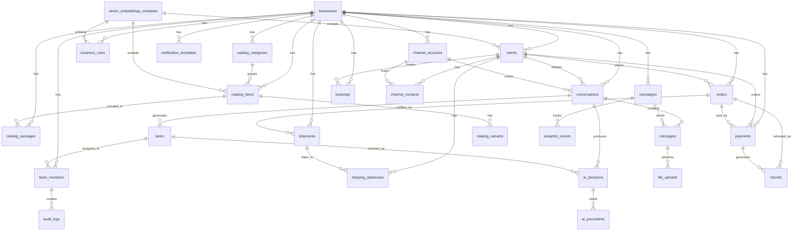

# GoSumo — Database Design

> PostgreSQL 16 schema for an AI-powered, channel-agnostic, multi-tenant client management platform.
> **ORM:** Prisma (schema is the single source of truth — generates TypeScript types automatically).
> **Design Principles:** UUID PKs everywhere, `business_id` on every table, soft deletes via `deleted_at`, JSONB for genuinely flexible payloads, strict foreign keys, Row-Level Security as defense-in-depth.

---

## Table of Contents

1. [ER Diagram](#1-er-diagram)
2. [Multi-Tenant Design](#2-multi-tenant-design)
3. [Prisma Schema](#3-prisma-schema)
   - [Enums](#enums)
   - [Platform Layer](#platform-layer)
   - [Channel & Messaging Layer](#channel--messaging-layer)
   - [Intelligence Layer](#intelligence-layer)
   - [Commerce Layer](#commerce-layer)
   - [Engagement Layer](#engagement-layer)
   - [Operations Layer](#operations-layer)
4. [Row-Level Security Policies](#4-row-level-security-policies)
5. [Partitioning Strategy](#5-partitioning-strategy)
6. [Indexing Strategy](#6-indexing-strategy)
7. [JSONB Usage Guidelines](#7-jsonb-usage-guidelines)
8. [Soft Delete Pattern](#8-soft-delete-pattern)
9. [Migration Strategy](#9-migration-strategy)
10. [Seed Data](#10-seed-data)

---

## 1. ER Diagram



---

## 2. Multi-Tenant Design

### Core Principle

Every table that contains business-specific data carries a `business_id UUID NOT NULL` column with a foreign key to `businesses`. This is enforced at three layers:

1. **Prisma schema** — `business_id` is non-optional on every relevant model
2. **NestJS service layer** — `@TenantScoped()` decorator injects `businessId` into every query
3. **PostgreSQL RLS** — fallback enforcement at the database level (see [Section 4](#4-row-level-security-policies))

### Global vs Tenant Tables

| Scope | Tables |
|---|---|
| **Global** (no `business_id`) | `consumer_users`, `webhook_events`, `audit_logs` (business_id nullable for platform-level events) |
| **Tenant** (require `business_id`) | All other tables |

### Application Roles

```sql
-- Read/write role for the API server (used by Prisma connection)
CREATE ROLE gosumo_app LOGIN PASSWORD '...';

-- Read-only role for analytics/reporting
CREATE ROLE gosumo_readonly LOGIN PASSWORD '...';

-- Superuser role for migrations only (never used at runtime)
CREATE ROLE gosumo_migrations LOGIN PASSWORD '...';
```

---

## 3. Prisma Schema

The canonical schema lives at `packages/database/prisma/schema.prisma`.

### Enums

```prisma
// packages/database/prisma/schema.prisma

generator client {
  provider        = "prisma-client-js"
  previewFeatures = ["postgresqlExtensions", "multiSchema"]
}

datasource db {
  provider   = "postgresql"
  url        = env("DATABASE_URL")
  extensions = [uuidOssp(map: "uuid-ossp"), pgcrypto, pgvector]
}

// ─────────────────────────────────────────────
// ENUMS
// ─────────────────────────────────────────────

enum ChannelType {
  WHATSAPP
  INSTAGRAM
  SMS
  WEB_CHAT
  EMAIL
  TELEGRAM
  FACEBOOK_MESSENGER
}

enum MessageDirection {
  INBOUND
  OUTBOUND
}

enum MessageType {
  TEXT
  IMAGE
  VIDEO
  AUDIO
  DOCUMENT
  LOCATION
  STICKER
  INTERACTIVE
  TEMPLATE
  PAYMENT_LINK
  REACTION
  SYSTEM
}

enum MessageStatus {
  PENDING
  SENT
  DELIVERED
  READ
  FAILED
}

enum ConversationStatus {
  OPEN
  PENDING_HUMAN
  ESCALATED
  RESOLVED
  SNOOZED
}

enum ConversationChannel {
  WHATSAPP
  INSTAGRAM
  SMS
  WEB_CHAT
  EMAIL
  TELEGRAM
  FACEBOOK_MESSENGER
}

enum TeamMemberRole {
  OWNER
  MANAGER
  STAFF
  VIEWER
}

enum TeamMemberStatus {
  ACTIVE
  INVITED
  SUSPENDED
}

enum TaskStatus {
  PENDING
  IN_PROGRESS
  RESOLVED
  ESCALATED
  EXPIRED
}

enum TaskType {
  REVIEW_RESPONSE
  APPROVE_REFUND
  APPROVE_DISCOUNT
  HANDLE_COMPLAINT
  CLARIFY_INTENT
  FOLLOW_UP
  APPROVE_ORDER
  CUSTOM
}

enum TaskPriority {
  LOW
  MEDIUM
  HIGH
  URGENT
}

enum AiDecisionOutcome {
  AUTO_EXECUTED
  SENT_FOR_REVIEW
  ESCALATED
  OVERRIDDEN_BY_HUMAN
  EXPIRED
}

enum AiDecisionType {
  SEND_MESSAGE
  CREATE_ORDER
  PROCESS_REFUND
  APPLY_DISCOUNT
  CREATE_BOOKING
  CANCEL_BOOKING
  SHARE_CATALOG
  COLLECT_PAYMENT
  ESCALATE
  RESOLVE_CONVERSATION
  CUSTOM_ACTION
}

enum RuleType {
  PRICE
  REFUND
  DISCOUNT
  ESCALATION
  WORKING_HOURS
  AUTO_REPLY
  CATALOG_RESTRICTION
  CUSTOM
}

enum RuleTrigger {
  ALWAYS
  INTENT_MATCH
  KEYWORD_MATCH
  TIME_WINDOW
  CLIENT_SEGMENT
  PRODUCT_CATEGORY
  ORDER_VALUE
}

enum OrderStatus {
  DRAFT
  CONFIRMED
  PROCESSING
  PACKED
  SHIPPED
  DELIVERED
  CANCELLED
  REFUNDED
  PARTIALLY_REFUNDED
}

enum PaymentStatus {
  PENDING
  INITIATED
  SUCCESS
  FAILED
  EXPIRED
  REFUNDED
  PARTIALLY_REFUNDED
}

enum PaymentMethod {
  UPI
  CARD
  NET_BANKING
  WALLET
  COD
  EMI
  BNPL
}

enum PaymentGateway {
  RAZORPAY
  PAYTM
  PHONEPE
  STRIPE
  MANUAL
}

enum RefundStatus {
  INITIATED
  PROCESSING
  COMPLETED
  FAILED
  REJECTED
}

enum BookingStatus {
  PENDING
  CONFIRMED
  RESCHEDULED
  CANCELLED
  NO_SHOW
  COMPLETED
}

enum ShipmentStatus {
  PENDING
  PICKUP_SCHEDULED
  PICKED_UP
  IN_TRANSIT
  OUT_FOR_DELIVERY
  DELIVERED
  FAILED_DELIVERY
  RETURNED
  CANCELLED
}

enum CampaignStatus {
  DRAFT
  SCHEDULED
  RUNNING
  PAUSED
  COMPLETED
  FAILED
  CANCELLED
}

enum CampaignType {
  BROADCAST
  DRIP
  TRIGGER_BASED
  RE_ENGAGEMENT
  PROMOTIONAL
  TRANSACTIONAL
}

enum CatalogItemType {
  PRODUCT
  SERVICE
  DIGITAL
  SUBSCRIPTION
}

enum EmbeddingEntityType {
  CLIENT_PROFILE
  CATALOG_ITEM
  CATALOG_CATEGORY
  BUSINESS_RULE
  CONVERSATION_SUMMARY
  FAQ
  DOCUMENT
}

enum NotificationTemplateChannel {
  WHATSAPP
  SMS
  EMAIL
  PUSH
}

enum AuditAction {
  CREATE
  UPDATE
  DELETE
  LOGIN
  LOGOUT
  APPROVE
  REJECT
  ESCALATE
  RESOLVE
  EXPORT
  IMPORT
}

enum FileUploadType {
  IMAGE
  VIDEO
  AUDIO
  DOCUMENT
  CSV
  OTHER
}

enum AnalyticsEventCategory {
  MESSAGE
  CONVERSATION
  AI
  ORDER
  PAYMENT
  BOOKING
  CAMPAIGN
  CHANNEL
  TEAM
  CLIENT
}
```

---

### Platform Layer

```prisma
// ─────────────────────────────────────────────
// PLATFORM LAYER
// ─────────────────────────────────────────────

/// A GoSumo tenant — a small business using the platform.
model businesses {
  id          String    @id @default(dbgenerated("uuid_generate_v4()")) @db.Uuid
  name        String    @db.VarChar(255)
  slug        String    @unique @db.VarChar(100)  // URL-safe identifier, immutable after creation
  email       String    @unique @db.VarChar(320)
  phone       String?   @db.VarChar(20)
  country     String    @default("IN") @db.Char(2)  // ISO 3166-1 alpha-2
  timezone    String    @default("Asia/Kolkata") @db.VarChar(50)
  currency    String    @default("INR") @db.Char(3)  // ISO 4217
  logo_url    String?   @db.Text
  website_url String?   @db.Text

  // Subscription & billing
  plan        String    @default("starter") @db.VarChar(50)
  plan_limits Json      @default("{}") @db.JsonB  // {maxTeamMembers, maxConversations, maxCampaigns, ...}

  // AI autonomy settings
  ai_settings Json      @default("{}") @db.JsonB
  // {
  //   autoExecuteThreshold: 90,    // confidence % to auto-execute
  //   reviewThreshold: 70,          // confidence % to send for review
  //   escalateBelow: 70,            // confidence % to escalate
  //   enabledChannels: ["WHATSAPP"],
  //   personality: "friendly",
  //   languagePreferences: ["hi", "en"]
  // }

  // Business profile for AI context
  profile     Json      @default("{}") @db.JsonB
  // {
  //   description, category, workingHours, holidays,
  //   returnPolicy, shippingPolicy, supportEmail, supportPhone
  // }

  is_active   Boolean   @default(true)
  created_at  DateTime  @default(now()) @db.Timestamptz
  updated_at  DateTime  @updatedAt @db.Timestamptz
  deleted_at  DateTime? @db.Timestamptz  // soft delete

  // Relations
  team_members            team_members[]
  clients                 clients[]
  channel_accounts        channel_accounts[]
  conversations           conversations[]
  messages                messages[]
  business_rules          business_rules[]
  catalog_categories      catalog_categories[]
  catalog_items           catalog_items[]
  catalog_variants        catalog_variants[]
  catalog_packages        catalog_packages[]
  orders                  orders[]
  payments                payments[]
  bookings                bookings[]
  shipments               shipments[]
  campaigns               campaigns[]
  notification_templates  notification_templates[]
  tasks                   tasks[]
  ai_decisions            ai_decisions[]
  ai_precedents           ai_precedents[]
  analytics_events        analytics_events[]
  vector_embeddings_metadata vector_embeddings_metadata[]
  file_uploads            file_uploads[]
  audit_logs              audit_logs[]
  webhook_events          webhook_events[]

  @@index([slug])
  @@index([email])
  @@index([is_active, created_at])
  @@index([deleted_at]) // partial index via raw migration: WHERE deleted_at IS NULL
  @@map("businesses")
}

/// A human operator who belongs to a business.
model team_members {
  id            String           @id @default(dbgenerated("uuid_generate_v4()")) @db.Uuid
  business_id   String           @db.Uuid
  email         String           @db.VarChar(320)
  name          String           @db.VarChar(255)
  avatar_url    String?          @db.Text
  role          TeamMemberRole   @default(STAFF)
  status        TeamMemberStatus @default(INVITED)
  phone         String?          @db.VarChar(20)

  // Auth (hashed, never raw)
  password_hash String?          @db.Text
  totp_secret   String?          @db.Text  // encrypted at rest; AES-256 via KMS
  last_login_at DateTime?        @db.Timestamptz
  login_count   Int              @default(0)

  // Notification preferences
  notification_prefs Json  @default("{}") @db.JsonB
  // { email: true, whatsapp: false, sound: true, taskAlerts: true }

  // Invite flow
  invite_token  String?          @unique @db.VarChar(64)
  invited_by    String?          @db.Uuid   // FK to team_members
  invited_at    DateTime?        @db.Timestamptz

  created_at    DateTime         @default(now()) @db.Timestamptz
  updated_at    DateTime         @updatedAt @db.Timestamptz
  deleted_at    DateTime?        @db.Timestamptz

  // Relations
  business      businesses       @relation(fields: [business_id], references: [id], onDelete: Cascade)
  inviter       team_members?    @relation("InvitedBy", fields: [invited_by], references: [id])
  invitees      team_members[]   @relation("InvitedBy")
  assigned_tasks tasks[]         @relation("AssignedTo")
  resolved_tasks tasks[]         @relation("ResolvedBy")
  audit_logs    audit_logs[]

  @@unique([business_id, email])
  @@index([business_id, status])
  @@index([business_id, role])
  @@index([invite_token])
  @@map("team_members")
}

/// A client/customer that contacts a business.
model clients {
  id          String    @id @default(dbgenerated("uuid_generate_v4()")) @db.Uuid
  business_id String    @db.Uuid

  // Core identity — all optional because a client may be identified only by channel
  name        String?   @db.VarChar(255)
  email       String?   @db.VarChar(320)
  phone       String?   @db.VarChar(20)  // E.164 format
  avatar_url  String?   @db.Text

  // Link to cross-merchant consumer profile (future feature)
  consumer_user_id String? @db.Uuid

  // AI-built profile (append-only enrichment)
  profile     Json      @default("{}") @db.JsonB
  // {
  //   preferredLanguage, sentiment, interests, demographics,
  //   purchaseFrequency, avgOrderValue, notes
  // }

  // Intelligence scores (recomputed by ai-engine)
  ltv_score       Decimal?  @db.Decimal(12, 2)
  churn_risk      Decimal?  @db.Decimal(5, 4)   // 0.0000 to 1.0000
  engagement_score Decimal? @db.Decimal(5, 4)
  scores_updated_at DateTime? @db.Timestamptz

  // Opt-out tracking per channel
  opt_outs    Json      @default("{}") @db.JsonB  // { "WHATSAPP": true, "SMS": false }

  // Stats (denormalized for fast read, updated by background job)
  total_orders       Int     @default(0)
  total_spent        Decimal @default(0) @db.Decimal(14, 2)
  last_interaction_at DateTime? @db.Timestamptz

  first_seen_at DateTime  @default(now()) @db.Timestamptz
  created_at    DateTime  @default(now()) @db.Timestamptz
  updated_at    DateTime  @updatedAt @db.Timestamptz
  deleted_at    DateTime? @db.Timestamptz

  // Relations
  business          businesses        @relation(fields: [business_id], references: [id], onDelete: Cascade)
  consumer_user     consumer_users?   @relation(fields: [consumer_user_id], references: [id])
  channel_contacts  channel_contacts[]
  conversations     conversations[]
  orders            orders[]
  bookings          bookings[]
  payments          payments[]
  shipping_addresses shipping_addresses[]
  analytics_events  analytics_events[]

  @@unique([business_id, phone], map: "uq_clients_business_phone")
  @@unique([business_id, email], map: "uq_clients_business_email")
  @@index([business_id, churn_risk])
  @@index([business_id, ltv_score])
  @@index([business_id, last_interaction_at])
  @@index([consumer_user_id])
  @@map("clients")
}

/// Cross-merchant consumer profile (future: one person, multiple businesses).
/// Intentionally minimal at launch — populated via opt-in linkage only.
model consumer_users {
  id          String    @id @default(dbgenerated("uuid_generate_v4()")) @db.Uuid
  phone       String?   @unique @db.VarChar(20)
  email       String?   @unique @db.VarChar(320)
  name        String?   @db.VarChar(255)

  created_at  DateTime  @default(now()) @db.Timestamptz
  updated_at  DateTime  @updatedAt @db.Timestamptz
  deleted_at  DateTime? @db.Timestamptz

  clients     clients[]

  @@map("consumer_users")
}
```

---

### Channel & Messaging Layer

```prisma
// ─────────────────────────────────────────────
// CHANNEL & MESSAGING LAYER
// ─────────────────────────────────────────────

/// A business's account on a specific messaging channel (e.g., their WhatsApp number).
model channel_accounts {
  id          String      @id @default(dbgenerated("uuid_generate_v4()")) @db.Uuid
  business_id String      @db.Uuid
  channel     ChannelType
  name        String      @db.VarChar(255)    // human label, e.g. "Main WhatsApp"
  is_primary  Boolean     @default(false)

  // Channel-specific external identifiers
  external_id      String  @db.VarChar(255)   // Phone number ID, IG account ID, etc.
  external_account String? @db.VarChar(255)   // WABA ID, page ID, etc.

  // Credentials — stored encrypted; actual secrets live in KMS/Vault
  credentials Json  @default("{}") @db.JsonB
  // { accessToken: "enc:...", webhookVerifyToken: "enc:...", appSecret: "enc:..." }

  // Webhook configuration
  webhook_url    String?  @db.Text
  webhook_secret String?  @db.Text   // HMAC secret for signature verification

  // Status and capabilities
  is_active      Boolean  @default(true)
  is_verified    Boolean  @default(false)
  capabilities   Json     @default("{}") @db.JsonB
  // { supportsTemplates, supportsInteractive, supportsMedia, supportsVoice }

  // Rate limit tracking
  message_limit_per_day Int?
  messages_sent_today   Int     @default(0)
  limit_reset_at        DateTime? @db.Timestamptz

  metadata    Json      @default("{}") @db.JsonB  // Channel-specific extras

  created_at  DateTime  @default(now()) @db.Timestamptz
  updated_at  DateTime  @updatedAt @db.Timestamptz
  deleted_at  DateTime? @db.Timestamptz

  business         businesses       @relation(fields: [business_id], references: [id], onDelete: Cascade)
  channel_contacts channel_contacts[]
  conversations    conversations[]
  notification_templates notification_templates[]

  @@unique([business_id, channel, external_id])
  @@index([business_id, channel, is_active])
  @@map("channel_accounts")
}

/// Maps a channel-specific external ID (phone number, IG user ID) to an internal client.
/// One client can be known under multiple channels; one channel contact maps to exactly one client.
model channel_contacts {
  id                 String      @id @default(dbgenerated("uuid_generate_v4()")) @db.Uuid
  business_id        String      @db.Uuid
  client_id          String      @db.Uuid
  channel_account_id String      @db.Uuid
  channel            ChannelType

  // External identity on this channel
  external_id        String      @db.VarChar(255)  // Phone, IG user ID, email, etc.
  display_name       String?     @db.VarChar(255)
  profile_pic_url    String?     @db.Text
  is_opted_in        Boolean     @default(true)

  // Metadata from channel (avatar, follower count for IG, etc.)
  channel_metadata   Json        @default("{}") @db.JsonB

  first_seen_at  DateTime  @default(now()) @db.Timestamptz
  last_seen_at   DateTime  @default(now()) @db.Timestamptz
  created_at     DateTime  @default(now()) @db.Timestamptz
  updated_at     DateTime  @updatedAt @db.Timestamptz

  business        businesses      @relation(fields: [business_id], references: [id], onDelete: Cascade)
  client          clients         @relation(fields: [client_id], references: [id], onDelete: Cascade)
  channel_account channel_accounts @relation(fields: [channel_account_id], references: [id])

  // A given external user can only appear once per channel account
  @@unique([channel_account_id, external_id])
  @@index([business_id, channel, external_id])
  @@index([client_id])
  @@map("channel_contacts")
}

/// A conversation thread between a client and a business via a specific channel.
/// A single client may have multiple conversations (one per thread/session).
model conversations {
  id                 String             @id @default(dbgenerated("uuid_generate_v4()")) @db.Uuid
  business_id        String             @db.Uuid
  client_id          String             @db.Uuid
  channel_account_id String             @db.Uuid
  channel            ConversationChannel

  status             ConversationStatus @default(OPEN)

  // Current AI understanding of the conversation
  current_intent     String?            @db.VarChar(100)
  intent_confidence  Decimal?           @db.Decimal(5, 4)
  current_topic      String?            @db.VarChar(100)

  // Human assignment
  assigned_to        String?            @db.Uuid  // FK to team_members

  // Conversation metadata
  subject            String?            @db.VarChar(500)  // Email subject / conversation title
  external_thread_id String?            @db.VarChar(255)  // Channel's thread ID

  // Lifecycle timestamps
  first_message_at   DateTime?          @db.Timestamptz
  last_message_at    DateTime?          @db.Timestamptz
  resolved_at        DateTime?          @db.Timestamptz
  snoozed_until      DateTime?          @db.Timestamptz

  // Counters (maintained by triggers/jobs to avoid COUNT(*) queries)
  message_count      Int                @default(0)
  unread_count       Int                @default(0)
  human_message_count Int               @default(0)

  // CSAT
  csat_score         Int?               // 1-5
  csat_submitted_at  DateTime?          @db.Timestamptz

  tags               String[]           @default([])  // Fast tag filtering

  // Flexible metadata (channel-specific context window IDs, etc.)
  metadata           Json               @default("{}") @db.JsonB

  created_at  DateTime  @default(now()) @db.Timestamptz
  updated_at  DateTime  @updatedAt @db.Timestamptz
  deleted_at  DateTime? @db.Timestamptz

  business        businesses       @relation(fields: [business_id], references: [id], onDelete: Cascade)
  client          clients          @relation(fields: [client_id], references: [id])
  channel_account channel_accounts @relation(fields: [channel_account_id], references: [id])
  messages        messages[]
  tasks           tasks[]
  ai_decisions    ai_decisions[]
  analytics_events analytics_events[]

  @@index([business_id, status, last_message_at(sort: Desc)])
  @@index([business_id, client_id])
  @@index([business_id, assigned_to, status])
  @@index([business_id, channel, status])
  @@index([client_id, status])
  // Partial index for open conversations only (most frequent query)
  // Created via raw SQL in migration: CREATE INDEX ON conversations (business_id, last_message_at DESC) WHERE status = 'OPEN' AND deleted_at IS NULL
  @@map("conversations")
}

/// An individual message within a conversation.
/// High-volume table — partitioned by created_at month (see Section 5).
model messages {
  id              String           @id @default(dbgenerated("uuid_generate_v4()")) @db.Uuid
  business_id     String           @db.Uuid
  conversation_id String           @db.Uuid
  channel_account_id String        @db.Uuid

  direction       MessageDirection
  type            MessageType      @default(TEXT)
  status          MessageStatus    @default(PENDING)

  // Sender info
  sender_type     String           @db.VarChar(20)  // "CLIENT" | "AI" | "HUMAN_AGENT" | "SYSTEM"
  sender_id       String?          @db.Uuid          // client_id or team_member_id

  // Content (polymorphic)
  content         Json             @db.JsonB
  // TEXT:     { text: string }
  // IMAGE:    { url, caption, mimeType, width?, height?, fileSize? }
  // VIDEO:    { url, caption, mimeType, duration?, fileSize? }
  // AUDIO:    { url, mimeType, duration?, fileSize?, transcript? }
  // DOCUMENT: { url, filename, mimeType, fileSize? }
  // LOCATION: { latitude, longitude, name?, address? }
  // TEMPLATE: { templateName, language, components: [...] }
  // INTERACTIVE: { type, header?, body, footer?, action }

  // External delivery tracking
  external_id     String?          @db.VarChar(255)  // Channel-assigned message ID
  external_status String?          @db.VarChar(50)   // Channel-specific status code
  delivered_at    DateTime?        @db.Timestamptz
  read_at         DateTime?        @db.Timestamptz
  failed_at       DateTime?        @db.Timestamptz
  failure_reason  String?          @db.Text

  // AI attribution
  ai_decision_id  String?          @db.Uuid
  is_ai_generated Boolean          @default(false)
  confidence_score Decimal?        @db.Decimal(5, 4)

  // Campaign attribution
  campaign_id     String?          @db.Uuid

  // Reaction tracking (for supported channels)
  reactions       Json             @default("[]") @db.JsonB  // [{ emoji, senderId, at }]

  // Full-text search support
  text_content    String?          @db.Text  // Extracted text for FTS (denormalized)

  metadata        Json             @default("{}") @db.JsonB  // Raw channel payload

  sent_at         DateTime?        @db.Timestamptz
  created_at      DateTime         @default(now()) @db.Timestamptz
  updated_at      DateTime         @updatedAt @db.Timestamptz

  business        businesses       @relation(fields: [business_id], references: [id], onDelete: Cascade)
  conversation    conversations    @relation(fields: [conversation_id], references: [id], onDelete: Cascade)
  channel_account channel_accounts @relation(fields: [channel_account_id], references: [id])
  campaign        campaigns?       @relation(fields: [campaign_id], references: [id])
  file_uploads    file_uploads[]

  @@index([conversation_id, created_at(sort: Desc)])
  @@index([business_id, created_at(sort: Desc)])
  @@index([business_id, sender_type, created_at(sort: Desc)])
  @@index([external_id])
  @@index([campaign_id])
  // FTS index added in raw migration: CREATE INDEX ON messages USING gin(to_tsvector('english', coalesce(text_content, '')))
  @@map("messages")
}

/// Uploaded media and document references.
model file_uploads {
  id          String         @id @default(dbgenerated("uuid_generate_v4()")) @db.Uuid
  business_id String         @db.Uuid
  message_id  String?        @db.Uuid
  type        FileUploadType
  filename    String         @db.VarChar(500)
  mime_type   String         @db.VarChar(100)
  size_bytes  Int
  storage_key String         @db.Text     // S3 object key
  cdn_url     String?        @db.Text     // Public CDN URL (after processing)

  // Image-specific
  width       Int?
  height      Int?
  thumbnail_key String?      @db.Text

  // Processing state
  is_processed Boolean       @default(false)
  is_public    Boolean       @default(false)

  // PII scan result
  pii_detected Boolean?

  metadata    Json           @default("{}") @db.JsonB

  created_at  DateTime       @default(now()) @db.Timestamptz
  updated_at  DateTime       @updatedAt @db.Timestamptz
  deleted_at  DateTime?      @db.Timestamptz

  business    businesses     @relation(fields: [business_id], references: [id], onDelete: Cascade)
  message     messages?      @relation(fields: [message_id], references: [id])

  @@index([business_id, type])
  @@index([message_id])
  @@index([storage_key])
  @@map("file_uploads")
}

/// Reusable message templates (WhatsApp approved templates, SMS templates, email templates).
model notification_templates {
  id                 String                      @id @default(dbgenerated("uuid_generate_v4()")) @db.Uuid
  business_id        String                      @db.Uuid
  channel_account_id String?                     @db.Uuid  // null = all accounts of this channel
  channel            NotificationTemplateChannel
  name               String                      @db.VarChar(255)
  external_name      String?                     @db.VarChar(255)  // WhatsApp approved template name

  // Template content (channel-specific structure in JSONB)
  content            Json                        @db.JsonB
  // WhatsApp: { header?, body, footer?, buttons?, language }
  // SMS: { body: "Hello {{name}}" }
  // Email: { subject, bodyHtml, bodyText, fromName, fromEmail }

  // Variable definitions
  variables          Json                        @default("[]") @db.JsonB
  // [{ key: "name", label: "Customer Name", required: true }]

  // Approval status (WhatsApp requires template approval)
  is_approved        Boolean                     @default(false)
  approval_status    String?                     @db.VarChar(50)  // PENDING | APPROVED | REJECTED
  approved_at        DateTime?                   @db.Timestamptz
  rejection_reason   String?                     @db.Text

  category           String?                     @db.VarChar(50)  // MARKETING | UTILITY | AUTHENTICATION
  language           String                      @default("en") @db.VarChar(10)
  is_active          Boolean                     @default(true)

  created_at  DateTime  @default(now()) @db.Timestamptz
  updated_at  DateTime  @updatedAt @db.Timestamptz
  deleted_at  DateTime? @db.Timestamptz

  business        businesses       @relation(fields: [business_id], references: [id], onDelete: Cascade)
  channel_account channel_accounts? @relation(fields: [channel_account_id], references: [id])

  @@unique([business_id, channel, name])
  @@index([business_id, channel, is_active])
  @@map("notification_templates")
}

/// Idempotent log of all incoming webhooks from external systems.
/// Prevents double-processing on retry. Scoped to business where applicable.
model webhook_events {
  id           String    @id @default(dbgenerated("uuid_generate_v4()")) @db.Uuid
  business_id  String?   @db.Uuid  // null for platform-level webhooks (e.g. Razorpay WABA)
  source       String    @db.VarChar(50)   // "WHATSAPP" | "RAZORPAY" | "SHIPROCKET" | ...
  event_type   String    @db.VarChar(100)  // e.g. "messages" | "payment.captured"
  external_id  String    @db.VarChar(255)  // Channel-specific event ID for deduplication

  // Raw payload for replay/debugging
  payload      Json      @db.JsonB
  headers      Json      @default("{}") @db.JsonB

  // Processing state
  processed    Boolean   @default(false)
  processed_at DateTime? @db.Timestamptz
  attempts     Int       @default(0)
  error        String?   @db.Text

  // Signature verification result
  signature_valid Boolean @default(false)

  received_at  DateTime  @default(now()) @db.Timestamptz

  business     businesses? @relation(fields: [business_id], references: [id])

  // Deduplication: same external event from same source must not be re-inserted
  @@unique([source, external_id])
  @@index([source, processed, received_at])
  @@index([business_id, received_at(sort: Desc)])
  @@map("webhook_events")
}
```

---

### Intelligence Layer

```prisma
// ─────────────────────────────────────────────
// INTELLIGENCE LAYER
// ─────────────────────────────────────────────

/// Business rules that constrain AI behaviour (pricing, refunds, discounts, working hours).
model business_rules {
  id          String      @id @default(dbgenerated("uuid_generate_v4()")) @db.Uuid
  business_id String      @db.Uuid
  type        RuleType
  name        String      @db.VarChar(255)
  description String?     @db.Text
  trigger     RuleTrigger @default(ALWAYS)
  priority    Int         @default(0)  // Higher = checked first
  is_active   Boolean     @default(true)

  // Rule definition (structure varies by type)
  conditions  Json        @default("{}") @db.JsonB
  // { intent?: ["order_query"], keywords?: ["refund"], timeWindow?: { start: "09:00", end: "18:00", tz: "Asia/Kolkata" }, clientSegment?: "vip" }

  actions     Json        @default("{}") @db.JsonB
  // PRICE:    { maxDiscountPercent, minOrderValue }
  // REFUND:   { maxRefundAmount, withinDays, requiresApproval }
  // ESCALATE: { conditions: [...], to: "team_member_id" }
  // AUTO_REPLY: { message: "We're closed. Working hours are..." }

  // Metadata for AI context
  embedding_text String?  @db.Text  // Denormalized text description for RAG indexing

  created_at  DateTime    @default(now()) @db.Timestamptz
  updated_at  DateTime    @updatedAt @db.Timestamptz
  deleted_at  DateTime?   @db.Timestamptz

  business    businesses  @relation(fields: [business_id], references: [id], onDelete: Cascade)
  vector_embedding vector_embeddings_metadata? @relation("RuleEmbedding")

  @@index([business_id, type, is_active])
  @@index([business_id, trigger, priority])
  @@map("business_rules")
}

/// Every decision the AI makes — immutable audit trail.
model ai_decisions {
  id              String            @id @default(dbgenerated("uuid_generate_v4()")) @db.Uuid
  business_id     String            @db.Uuid
  conversation_id String            @db.Uuid
  message_id      String?           @db.Uuid  // The triggering message
  task_id         String?           @db.Uuid  // The task created for human review (if any)

  type            AiDecisionType
  outcome         AiDecisionOutcome

  // What the AI decided to do
  proposed_action Json              @db.JsonB
  // { actionType, parameters, reasoning, alternativesConsidered }

  // Confidence breakdown
  confidence_score    Decimal       @db.Decimal(5, 4)  // 0.0000 to 1.0000
  confidence_breakdown Json         @default("{}") @db.JsonB
  // { dataAvailability: 0.9, policyClarity: 0.8, composite: 0.85, overrideFlags: [] }

  // Model info
  model_id        String?           @db.VarChar(100)   // "claude-3-5-sonnet-20241022"
  prompt_tokens   Int?
  completion_tokens Int?
  latency_ms      Int?

  // Human override (if any)
  was_overridden  Boolean           @default(false)
  override_by     String?           @db.Uuid   // team_member_id
  override_reason String?           @db.Text
  override_action Json?             @db.JsonB  // What the human did instead

  // Did this decision become a precedent?
  seeded_precedent_id String?       @db.Uuid

  decided_at      DateTime          @default(now()) @db.Timestamptz
  executed_at     DateTime?         @db.Timestamptz

  business     businesses    @relation(fields: [business_id], references: [id], onDelete: Cascade)
  conversation conversations @relation(fields: [conversation_id], references: [id])
  task         tasks?        @relation(fields: [task_id], references: [id])
  precedents   ai_precedents[]

  @@index([business_id, outcome, decided_at(sort: Desc)])
  @@index([conversation_id, decided_at(sort: Desc)])
  @@index([business_id, type, decided_at(sort: Desc)])
  @@index([was_overridden, decided_at(sort: Desc)])  // For feedback loop analysis
  @@map("ai_decisions")
}

/// Learned patterns derived from human corrections to AI decisions.
/// Fed back into the RAG pipeline as context for future similar situations.
model ai_precedents {
  id          String    @id @default(dbgenerated("uuid_generate_v4()")) @db.Uuid
  business_id String    @db.Uuid
  decision_id String    @db.Uuid  // The ai_decision that was overridden

  // Situation description (for RAG retrieval)
  situation_summary String  @db.Text
  intent          String?  @db.VarChar(100)

  // What the AI did vs what the human did
  ai_action       Json     @db.JsonB
  human_action    Json     @db.JsonB
  human_reasoning String?  @db.Text

  // Confidence adjustment derived from this precedent
  confidence_delta Decimal @db.Decimal(5, 4)  // Negative = AI overconfident here

  // How often this pattern has been applied
  apply_count     Int      @default(0)
  last_applied_at DateTime? @db.Timestamptz

  is_active       Boolean  @default(true)
  expires_at      DateTime? @db.Timestamptz  // Precedents can expire if business policy changes

  // Embedding in Qdrant (point ID stored here for reference)
  qdrant_point_id String?  @db.Uuid

  created_at  DateTime  @default(now()) @db.Timestamptz
  updated_at  DateTime  @updatedAt @db.Timestamptz

  business    businesses   @relation(fields: [business_id], references: [id], onDelete: Cascade)
  decision    ai_decisions @relation(fields: [decision_id], references: [id])

  @@index([business_id, intent, is_active])
  @@index([business_id, last_applied_at(sort: Desc)])
  @@map("ai_precedents")
}

/// Tracks what has been embedded in Qdrant so we can manage the vector store.
/// One row per embedded document. The actual vector lives in Qdrant.
model vector_embeddings_metadata {
  id             String              @id @default(dbgenerated("uuid_generate_v4()")) @db.Uuid
  business_id    String              @db.Uuid
  entity_type    EmbeddingEntityType
  entity_id      String              @db.Uuid   // FK to whichever table (polymorphic)

  // Qdrant reference
  collection     String              @db.VarChar(100)  // e.g. "gosumo_business_<uuid>"
  qdrant_point_id String             @db.Uuid

  // Content snapshot (for change detection — re-embed if hash changes)
  content_hash   String              @db.Char(64)   // SHA-256 of embedded text
  model_id       String              @db.VarChar(100)  // embedding model version

  // Status
  embedded_at    DateTime            @db.Timestamptz
  needs_reindex  Boolean             @default(false)

  created_at     DateTime            @default(now()) @db.Timestamptz
  updated_at     DateTime            @updatedAt @db.Timestamptz

  business       businesses          @relation(fields: [business_id], references: [id], onDelete: Cascade)
  business_rule  business_rules?     @relation("RuleEmbedding", fields: [entity_id], references: [id], map: "fk_embedding_rule")

  // One row per (entity_type, entity_id) combination
  @@unique([entity_type, entity_id])
  @@index([business_id, entity_type, needs_reindex])
  @@index([qdrant_point_id])
  @@map("vector_embeddings_metadata")
}

/// HITL task queue — created when AI is not confident enough to auto-execute.
model tasks {
  id              String       @id @default(dbgenerated("uuid_generate_v4()")) @db.Uuid
  business_id     String       @db.Uuid
  conversation_id String       @db.Uuid
  ai_decision_id  String?      @db.Uuid

  type            TaskType
  status          TaskStatus   @default(PENDING)
  priority        TaskPriority @default(MEDIUM)
  title           String       @db.VarChar(500)
  description     String?      @db.Text

  // Assignment
  assigned_to     String?      @db.Uuid  // team_member_id
  assigned_at     DateTime?    @db.Timestamptz

  // AI draft (the proposed response pending review)
  ai_draft        Json?        @db.JsonB
  // { message: string, actions: [...], confidence: 0.78 }

  // Human resolution
  resolved_by     String?      @db.Uuid  // team_member_id
  resolved_at     DateTime?    @db.Timestamptz
  resolution_note String?      @db.Text
  resolution      Json?        @db.JsonB   // The action human took

  // Deadline management
  due_at          DateTime?    @db.Timestamptz
  sla_minutes     Int?         // Minutes until SLA breach
  sla_breached    Boolean      @default(false)
  sla_breached_at DateTime?    @db.Timestamptz

  // Escalation chain
  escalated_from  String?      @db.Uuid   // FK to parent task
  escalation_level Int         @default(0)

  metadata        Json         @default("{}") @db.JsonB

  created_at      DateTime     @default(now()) @db.Timestamptz
  updated_at      DateTime     @updatedAt @db.Timestamptz

  business        businesses   @relation(fields: [business_id], references: [id], onDelete: Cascade)
  conversation    conversations @relation(fields: [conversation_id], references: [id])
  assignee        team_members? @relation("AssignedTo", fields: [assigned_to], references: [id])
  resolver        team_members? @relation("ResolvedBy", fields: [resolved_by], references: [id])
  parent_task     tasks?       @relation("EscalationChain", fields: [escalated_from], references: [id])
  child_tasks     tasks[]      @relation("EscalationChain")
  ai_decisions    ai_decisions[]

  @@index([business_id, status, priority, created_at(sort: Desc)])
  @@index([business_id, assigned_to, status])
  @@index([business_id, due_at, status])
  @@index([conversation_id])
  // Partial index: open tasks only
  // CREATE INDEX ON tasks (business_id, priority, created_at DESC) WHERE status IN ('PENDING', 'IN_PROGRESS')
  @@map("tasks")
}
```

---

### Commerce Layer

```prisma
// ─────────────────────────────────────────────
// COMMERCE LAYER
// ─────────────────────────────────────────────

/// Product/service catalog categories (tree structure via parent_id).
model catalog_categories {
  id          String    @id @default(dbgenerated("uuid_generate_v4()")) @db.Uuid
  business_id String    @db.Uuid
  parent_id   String?   @db.Uuid   // null = root category
  name        String    @db.VarChar(255)
  slug        String    @db.VarChar(100)
  description String?   @db.Text
  image_url   String?   @db.Text
  sort_order  Int       @default(0)
  is_active   Boolean   @default(true)
  metadata    Json      @default("{}") @db.JsonB

  created_at  DateTime  @default(now()) @db.Timestamptz
  updated_at  DateTime  @updatedAt @db.Timestamptz
  deleted_at  DateTime? @db.Timestamptz

  business    businesses          @relation(fields: [business_id], references: [id], onDelete: Cascade)
  parent      catalog_categories? @relation("CategoryTree", fields: [parent_id], references: [id])
  children    catalog_categories[] @relation("CategoryTree")
  items       catalog_items[]

  @@unique([business_id, slug])
  @@index([business_id, parent_id, is_active])
  @@map("catalog_categories")
}

/// A product, service, or digital item in the catalog.
model catalog_items {
  id             String          @id @default(dbgenerated("uuid_generate_v4()")) @db.Uuid
  business_id    String          @db.Uuid
  category_id    String?         @db.Uuid
  type           CatalogItemType @default(PRODUCT)
  name           String          @db.VarChar(500)
  slug           String          @db.VarChar(200)
  description    String?         @db.Text
  short_description String?      @db.VarChar(500)

  // Pricing (base price; variant prices override)
  price          Decimal         @db.Decimal(12, 2)
  compare_price  Decimal?        @db.Decimal(12, 2)  // Strikethrough price
  currency       String          @default("INR") @db.Char(3)
  tax_rate       Decimal         @default(0) @db.Decimal(5, 4)
  tax_inclusive  Boolean         @default(true)  // Whether price includes GST

  // Inventory (for PRODUCT type without variants)
  sku            String?         @db.VarChar(100)
  barcode        String?         @db.VarChar(100)
  stock_quantity Int?
  track_inventory Boolean        @default(false)
  allow_backorder Boolean        @default(false)
  low_stock_threshold Int?

  // Physical dimensions (for shipping)
  weight_grams   Int?
  length_cm      Decimal?        @db.Decimal(8, 2)
  width_cm       Decimal?        @db.Decimal(8, 2)
  height_cm      Decimal?        @db.Decimal(8, 2)

  // Media
  images         Json            @default("[]") @db.JsonB  // [{ url, alt, isPrimary }]

  // SEO & Discovery
  tags           String[]        @default([])

  // AI catalog context
  ai_description String?         @db.Text  // AI-friendly description for RAG

  is_active      Boolean         @default(true)
  is_featured    Boolean         @default(false)
  sort_order     Int             @default(0)

  metadata       Json            @default("{}") @db.JsonB

  created_at     DateTime        @default(now()) @db.Timestamptz
  updated_at     DateTime        @updatedAt @db.Timestamptz
  deleted_at     DateTime?       @db.Timestamptz

  business       businesses           @relation(fields: [business_id], references: [id], onDelete: Cascade)
  category       catalog_categories?  @relation(fields: [category_id], references: [id])
  variants       catalog_variants[]
  vector_embedding vector_embeddings_metadata? @relation

  @@unique([business_id, slug])
  @@index([business_id, category_id, is_active])
  @@index([business_id, type, is_active])
  @@index([business_id, is_featured, is_active])
  // FTS: CREATE INDEX ON catalog_items USING gin(to_tsvector('english', name || ' ' || coalesce(description, '') || ' ' || coalesce(ai_description, '')))
  @@map("catalog_items")
}

/// Product variants (size, colour, etc.).
model catalog_variants {
  id             String   @id @default(dbgenerated("uuid_generate_v4()")) @db.Uuid
  business_id    String   @db.Uuid
  item_id        String   @db.Uuid

  name           String   @db.VarChar(255)  // "Red / XL"
  sku            String?  @db.VarChar(100)
  barcode        String?  @db.VarChar(100)

  // Override prices (null = inherit from parent item)
  price          Decimal? @db.Decimal(12, 2)
  compare_price  Decimal? @db.Decimal(12, 2)

  // Attribute key-values (size=XL, color=red)
  attributes     Json     @default("{}") @db.JsonB  // { size: "XL", color: "red" }

  // Inventory
  stock_quantity Int?
  is_active      Boolean  @default(true)
  sort_order     Int      @default(0)

  // Media override
  image_url      String?  @db.Text

  created_at     DateTime  @default(now()) @db.Timestamptz
  updated_at     DateTime  @updatedAt @db.Timestamptz
  deleted_at     DateTime? @db.Timestamptz

  business       businesses    @relation(fields: [business_id], references: [id], onDelete: Cascade)
  item           catalog_items @relation(fields: [item_id], references: [id], onDelete: Cascade)

  @@unique([item_id, sku], map: "uq_variant_item_sku")
  @@index([business_id, item_id, is_active])
  @@map("catalog_variants")
}

/// Product bundles / packages (multiple items sold together).
model catalog_packages {
  id          String    @id @default(dbgenerated("uuid_generate_v4()")) @db.Uuid
  business_id String    @db.Uuid
  name        String    @db.VarChar(500)
  description String?   @db.Text
  price       Decimal   @db.Decimal(12, 2)
  is_active   Boolean   @default(true)

  // Package components (JSON avoids a join table for simplicity)
  items       Json      @default("[]") @db.JsonB
  // [{ itemId: uuid, variantId?: uuid, quantity: 2, label: "Starter Kit" }]

  metadata    Json      @default("{}") @db.JsonB

  created_at  DateTime  @default(now()) @db.Timestamptz
  updated_at  DateTime  @updatedAt @db.Timestamptz
  deleted_at  DateTime? @db.Timestamptz

  business    businesses @relation(fields: [business_id], references: [id], onDelete: Cascade)

  @@index([business_id, is_active])
  @@map("catalog_packages")
}

/// A customer order (can span multiple items and shipments).
model orders {
  id          String      @id @default(dbgenerated("uuid_generate_v4()")) @db.Uuid
  business_id String      @db.Uuid
  client_id   String      @db.Uuid
  conversation_id String? @db.Uuid

  order_number String      @db.VarChar(50)   // Human-readable: "ORD-2024-00123"
  status       OrderStatus @default(CONFIRMED)

  // Line items snapshot (denormalized at order time to prevent drift if catalog changes)
  line_items   Json        @db.JsonB
  // [{ itemId, variantId?, name, sku, quantity, unitPrice, totalPrice, taxAmount }]

  // Financial totals
  subtotal     Decimal     @db.Decimal(14, 2)
  discount_amount Decimal  @default(0) @db.Decimal(14, 2)
  tax_amount   Decimal     @default(0) @db.Decimal(14, 2)
  shipping_fee Decimal     @default(0) @db.Decimal(14, 2)
  total        Decimal     @db.Decimal(14, 2)
  currency     String      @default("INR") @db.Char(3)

  // Discount tracking
  discount_code  String?   @db.VarChar(50)
  discount_type  String?   @db.VarChar(20)   // PERCENT | FIXED
  discount_value Decimal?  @db.Decimal(10, 2)

  // Shipping
  shipping_address_id String? @db.Uuid
  shipping_option_id  String? @db.Uuid

  // Notes
  customer_note String?   @db.Text
  internal_note String?   @db.Text

  // Timestamps
  placed_at      DateTime  @default(now()) @db.Timestamptz
  confirmed_at   DateTime? @db.Timestamptz
  cancelled_at   DateTime? @db.Timestamptz
  cancellation_reason String? @db.Text

  metadata    Json      @default("{}") @db.JsonB

  created_at  DateTime  @default(now()) @db.Timestamptz
  updated_at  DateTime  @updatedAt @db.Timestamptz
  deleted_at  DateTime? @db.Timestamptz

  business          businesses         @relation(fields: [business_id], references: [id], onDelete: Cascade)
  client            clients            @relation(fields: [client_id], references: [id])
  shipping_address  shipping_addresses? @relation(fields: [shipping_address_id], references: [id])
  shipping_option   shipping_options?  @relation(fields: [shipping_option_id], references: [id])
  payments          payments[]
  shipments         shipments[]
  refunds           refunds[]

  @@unique([business_id, order_number])
  @@index([business_id, status, placed_at(sort: Desc)])
  @@index([business_id, client_id, status])
  @@index([client_id, placed_at(sort: Desc)])
  @@map("orders")
}

/// A payment record (one order can have multiple payment attempts).
model payments {
  id          String        @id @default(dbgenerated("uuid_generate_v4()")) @db.Uuid
  business_id String        @db.Uuid
  order_id    String?       @db.Uuid
  client_id   String        @db.Uuid

  status      PaymentStatus @default(PENDING)
  method      PaymentMethod?
  gateway     PaymentGateway @default(RAZORPAY)

  amount      Decimal       @db.Decimal(14, 2)
  currency    String        @default("INR") @db.Char(3)

  // Gateway-specific identifiers
  gateway_order_id   String? @db.VarChar(255)
  gateway_payment_id String? @db.VarChar(255)
  gateway_signature  String? @db.VarChar(500)

  // Payment link (for WhatsApp payment links)
  payment_link_url   String? @db.Text
  payment_link_id    String? @db.VarChar(255)
  payment_link_expires_at DateTime? @db.Timestamptz

  // Timestamps
  initiated_at       DateTime? @db.Timestamptz
  captured_at        DateTime? @db.Timestamptz
  failed_at          DateTime? @db.Timestamptz
  failure_reason     String?   @db.Text

  // Gateway webhook payload (for audit)
  gateway_response   Json      @default("{}") @db.JsonB

  metadata           Json      @default("{}") @db.JsonB

  created_at  DateTime  @default(now()) @db.Timestamptz
  updated_at  DateTime  @updatedAt @db.Timestamptz

  business    businesses  @relation(fields: [business_id], references: [id], onDelete: Cascade)
  order       orders?     @relation(fields: [order_id], references: [id])
  client      clients     @relation(fields: [client_id], references: [id])
  refunds     refunds[]

  @@index([business_id, status, created_at(sort: Desc)])
  @@index([order_id])
  @@index([client_id])
  @@index([gateway_payment_id])
  @@index([gateway_order_id])
  @@map("payments")
}

/// A refund against a payment.
model refunds {
  id          String       @id @default(dbgenerated("uuid_generate_v4()")) @db.Uuid
  business_id String       @db.Uuid
  payment_id  String       @db.Uuid
  order_id    String?      @db.Uuid

  status      RefundStatus @default(INITIATED)
  amount      Decimal      @db.Decimal(14, 2)
  currency    String       @default("INR") @db.Char(3)

  reason      String?      @db.Text
  notes       String?      @db.Text

  // Gateway details
  gateway_refund_id String? @db.VarChar(255)
  gateway_response  Json    @default("{}") @db.JsonB

  // Human approval (required above policy threshold)
  requires_approval Boolean  @default(false)
  approved_by       String?  @db.Uuid   // team_member_id
  approved_at       DateTime? @db.Timestamptz
  rejected_by       String?  @db.Uuid
  rejected_at       DateTime? @db.Timestamptz
  rejection_reason  String?  @db.Text

  initiated_at      DateTime @default(now()) @db.Timestamptz
  completed_at      DateTime? @db.Timestamptz
  failed_at         DateTime? @db.Timestamptz

  created_at  DateTime  @default(now()) @db.Timestamptz
  updated_at  DateTime  @updatedAt @db.Timestamptz

  business    businesses @relation(fields: [business_id], references: [id], onDelete: Cascade)
  payment     payments   @relation(fields: [payment_id], references: [id])
  order       orders?    @relation(fields: [order_id], references: [id])

  @@index([business_id, status, created_at(sort: Desc)])
  @@index([payment_id])
  @@index([order_id])
  @@map("refunds")
}

/// A customer shipping address.
model shipping_addresses {
  id          String    @id @default(dbgenerated("uuid_generate_v4()")) @db.Uuid
  business_id String    @db.Uuid
  client_id   String    @db.Uuid
  label       String?   @db.VarChar(50)   // "Home", "Work"
  is_default  Boolean   @default(false)

  recipient_name  String  @db.VarChar(255)
  line1           String  @db.VarChar(500)
  line2           String? @db.VarChar(500)
  city            String  @db.VarChar(100)
  state           String  @db.VarChar(100)
  pincode         String  @db.VarChar(20)
  country         String  @default("IN") @db.Char(2)
  phone           String? @db.VarChar(20)

  // Geocoding (for delivery cost calculation)
  latitude        Decimal? @db.Decimal(10, 7)
  longitude       Decimal? @db.Decimal(10, 7)

  created_at  DateTime  @default(now()) @db.Timestamptz
  updated_at  DateTime  @updatedAt @db.Timestamptz
  deleted_at  DateTime? @db.Timestamptz

  client      clients    @relation(fields: [client_id], references: [id], onDelete: Cascade)
  orders      orders[]

  @@index([client_id, is_default])
  @@map("shipping_addresses")
}

/// Available shipping options for a business (configured by business or fetched from logistics API).
model shipping_options {
  id          String    @id @default(dbgenerated("uuid_generate_v4()")) @db.Uuid
  business_id String    @db.Uuid
  name        String    @db.VarChar(255)
  carrier     String?   @db.VarChar(100)   // "Shiprocket", "Delhivery"
  is_active   Boolean   @default(true)

  // Pricing rules
  base_fee    Decimal   @db.Decimal(10, 2)
  per_kg_fee  Decimal   @default(0) @db.Decimal(10, 2)
  min_order_value_for_free Decimal? @db.Decimal(14, 2)  // Free shipping threshold

  // Delivery estimate
  min_days    Int?
  max_days    Int?

  metadata    Json      @default("{}") @db.JsonB

  created_at  DateTime  @default(now()) @db.Timestamptz
  updated_at  DateTime  @updatedAt @db.Timestamptz
  deleted_at  DateTime? @db.Timestamptz

  orders      orders[]
  shipments   shipments[]

  @@index([business_id, is_active])
  @@map("shipping_options")
}

/// A physical shipment for an order.
model shipments {
  id                 String         @id @default(dbgenerated("uuid_generate_v4()")) @db.Uuid
  business_id        String         @db.Uuid
  order_id           String         @db.Uuid
  shipping_address_id String?       @db.Uuid
  shipping_option_id  String?       @db.Uuid

  status             ShipmentStatus @default(PENDING)
  carrier            String?        @db.VarChar(100)
  service_type       String?        @db.VarChar(100)

  // Logistics provider reference
  provider           String?        @db.VarChar(50)   // "SHIPROCKET" | "DELHIVERY" | "MANUAL"
  provider_shipment_id String?      @db.VarChar(255)
  tracking_number    String?        @db.VarChar(255)
  tracking_url       String?        @db.Text
  awb_code           String?        @db.VarChar(100)  // Air Waybill for Shiprocket

  // Dimensions and weight (snapshot at time of shipping)
  weight_grams       Int?
  dimensions         Json?          @db.JsonB  // { length, width, height }

  // Cost
  shipping_cost      Decimal?       @db.Decimal(10, 2)

  // Timeline
  estimated_delivery_at DateTime?   @db.Timestamptz
  shipped_at         DateTime?      @db.Timestamptz
  delivered_at       DateTime?      @db.Timestamptz
  returned_at        DateTime?      @db.Timestamptz

  // Tracking events from logistics provider
  tracking_events    Json           @default("[]") @db.JsonB
  // [{ status, location, description, timestamp }]

  notes              String?        @db.Text
  metadata           Json           @default("{}") @db.JsonB

  created_at  DateTime  @default(now()) @db.Timestamptz
  updated_at  DateTime  @updatedAt @db.Timestamptz

  business         businesses         @relation(fields: [business_id], references: [id], onDelete: Cascade)
  order            orders             @relation(fields: [order_id], references: [id])
  shipping_address shipping_addresses? @relation(fields: [shipping_address_id], references: [id])
  shipping_option  shipping_options?  @relation(fields: [shipping_option_id], references: [id])

  @@index([business_id, status, created_at(sort: Desc)])
  @@index([order_id])
  @@index([tracking_number])
  @@index([provider_shipment_id])
  @@map("shipments")
}

/// A booking / appointment.
model bookings {
  id                String        @id @default(dbgenerated("uuid_generate_v4()")) @db.Uuid
  business_id       String        @db.Uuid
  client_id         String        @db.Uuid
  catalog_item_id   String?       @db.Uuid  // Which service was booked

  status            BookingStatus @default(PENDING)

  // Scheduling
  start_at          DateTime      @db.Timestamptz
  end_at            DateTime      @db.Timestamptz
  timezone          String        @default("Asia/Kolkata") @db.VarChar(50)
  duration_minutes  Int

  // Staff assignment
  staff_id          String?       @db.Uuid   // team_member_id

  // Location / mode
  location_type     String?       @db.VarChar(20)  // "IN_PERSON" | "ONLINE" | "HOME_VISIT"
  location_address  String?       @db.Text
  meeting_url       String?       @db.Text   // Zoom/Meet link for ONLINE

  // Google Calendar sync
  gcal_event_id     String?       @db.VarChar(255)
  gcal_calendar_id  String?       @db.VarChar(255)

  // Financial
  price             Decimal?      @db.Decimal(12, 2)
  deposit_amount    Decimal?      @db.Decimal(12, 2)
  payment_id        String?       @db.Uuid

  // Reminders
  reminders_sent    Int           @default(0)
  last_reminder_at  DateTime?     @db.Timestamptz

  // Cancellation
  cancelled_at      DateTime?     @db.Timestamptz
  cancellation_reason String?     @db.Text
  cancelled_by      String?       @db.VarChar(20)  // "CLIENT" | "BUSINESS" | "SYSTEM"

  notes             String?       @db.Text
  metadata          Json          @default("{}") @db.JsonB

  created_at  DateTime  @default(now()) @db.Timestamptz
  updated_at  DateTime  @updatedAt @db.Timestamptz
  deleted_at  DateTime? @db.Timestamptz

  business    businesses    @relation(fields: [business_id], references: [id], onDelete: Cascade)
  client      clients       @relation(fields: [client_id], references: [id])

  @@index([business_id, status, start_at])
  @@index([business_id, client_id])
  @@index([business_id, staff_id, start_at])
  @@index([gcal_event_id])
  // Partial index: upcoming bookings
  // CREATE INDEX ON bookings (business_id, start_at) WHERE status IN ('PENDING', 'CONFIRMED') AND deleted_at IS NULL
  @@map("bookings")
}
```

---

### Engagement Layer

```prisma
// ─────────────────────────────────────────────
// ENGAGEMENT LAYER
// ─────────────────────────────────────────────

/// A marketing or lifecycle campaign (broadcast, drip, trigger-based).
model campaigns {
  id          String         @id @default(dbgenerated("uuid_generate_v4()")) @db.Uuid
  business_id String         @db.Uuid
  name        String         @db.VarChar(255)
  description String?        @db.Text
  type        CampaignType
  status      CampaignStatus @default(DRAFT)
  channel     ChannelType

  // Targeting
  audience    Json           @default("{}") @db.JsonB
  // { segment: "all" | "vip" | "at_risk", filters: [...], estimatedCount: 1200 }

  // Message configuration
  template_id String?        @db.Uuid   // FK to notification_templates
  content     Json?          @db.JsonB  // Inline content if no template

  // Schedule (null = triggered, not scheduled)
  scheduled_at  DateTime?    @db.Timestamptz
  started_at    DateTime?    @db.Timestamptz
  completed_at  DateTime?    @db.Timestamptz
  paused_at     DateTime?    @db.Timestamptz

  // Drip sequence steps (for CampaignType.DRIP)
  drip_steps  Json           @default("[]") @db.JsonB
  // [{ stepNumber, delayHours, templateId, content }]

  // Stats (maintained by campaign worker)
  total_recipients   Int     @default(0)
  sent_count         Int     @default(0)
  delivered_count    Int     @default(0)
  read_count         Int     @default(0)
  reply_count        Int     @default(0)
  conversion_count   Int     @default(0)
  opt_out_count      Int     @default(0)
  error_count        Int     @default(0)

  // BullMQ job reference
  job_id      String?        @db.VarChar(255)

  metadata    Json           @default("{}") @db.JsonB

  created_by  String?        @db.Uuid   // team_member_id
  created_at  DateTime       @default(now()) @db.Timestamptz
  updated_at  DateTime       @updatedAt @db.Timestamptz
  deleted_at  DateTime?      @db.Timestamptz

  business    businesses  @relation(fields: [business_id], references: [id], onDelete: Cascade)
  messages    messages[]
  analytics_events analytics_events[]

  @@index([business_id, status, scheduled_at])
  @@index([business_id, type, status])
  @@map("campaigns")
}
```

---

### Operations Layer

```prisma
// ─────────────────────────────────────────────
// OPERATIONS LAYER
// ─────────────────────────────────────────────

/// High-volume event stream for analytics and autonomy KPIs.
/// Partitioned by created_at month (see Section 5).
model analytics_events {
  id              String                 @id @default(dbgenerated("uuid_generate_v4()")) @db.Uuid
  business_id     String                 @db.Uuid
  category        AnalyticsEventCategory
  event_name      String                 @db.VarChar(100)   // "message.sent", "order.created"

  // Entity references (polymorphic — null when not applicable)
  conversation_id String?                @db.Uuid
  client_id       String?                @db.Uuid
  order_id        String?                @db.Uuid
  campaign_id     String?                @db.Uuid
  team_member_id  String?                @db.Uuid

  // Event payload (flexible)
  properties      Json                   @default("{}") @db.JsonB
  // { channel, intent, confidence, amount, duration_ms, ... }

  // Session / actor
  actor_type      String?                @db.VarChar(20)  // "AI" | "HUMAN" | "SYSTEM"
  actor_id        String?                @db.Uuid

  created_at      DateTime               @default(now()) @db.Timestamptz

  business        businesses             @relation(fields: [business_id], references: [id], onDelete: Cascade)
  client          clients?               @relation(fields: [client_id], references: [id])
  campaign        campaigns?             @relation(fields: [campaign_id], references: [id])

  @@index([business_id, category, event_name, created_at(sort: Desc)])
  @@index([business_id, client_id, created_at(sort: Desc)])
  @@index([business_id, campaign_id, created_at(sort: Desc)])
  @@index([business_id, created_at(sort: Desc)])
  @@map("analytics_events")
}

/// Immutable audit log — records every significant action by team members or the system.
/// Append-only: no UPDATE or DELETE ever runs on this table.
model audit_logs {
  id              String      @id @default(dbgenerated("uuid_generate_v4()")) @db.Uuid
  business_id     String?     @db.Uuid   // null for platform-level events

  actor_type      String      @db.VarChar(20)   // "TEAM_MEMBER" | "AI" | "SYSTEM" | "API"
  actor_id        String?     @db.Uuid
  actor_email     String?     @db.VarChar(320)  // Snapshot at time of action

  action          AuditAction
  resource_type   String      @db.VarChar(100)  // "order" | "refund" | "business_rule" | ...
  resource_id     String?     @db.Uuid
  resource_before Json?       @db.JsonB   // State before (for UPDATE/DELETE)
  resource_after  Json?       @db.JsonB   // State after

  // Context
  ip_address      String?     @db.VarChar(45)   // IPv4 or IPv6
  user_agent      String?     @db.Text
  request_id      String?     @db.VarChar(64)   // Correlation ID for the HTTP request

  description     String?     @db.Text

  created_at      DateTime    @default(now()) @db.Timestamptz

  business        businesses? @relation(fields: [business_id], references: [id])
  team_member     team_members? @relation(fields: [actor_id], references: [id])

  // No deleted_at — this table is append-only
  @@index([business_id, action, created_at(sort: Desc)])
  @@index([business_id, resource_type, resource_id, created_at(sort: Desc)])
  @@index([actor_id, created_at(sort: Desc)])
  @@index([created_at(sort: Desc)])  // For retention / purge jobs
  @@map("audit_logs")
}
```

---

## 4. Row-Level Security Policies

RLS is the database-level enforcement layer. It activates only after the application sets `app.current_business_id` at connection time.

```sql
-- Run in 0001_enable_rls.sql migration

-- Function to get the current business ID from the session context
CREATE OR REPLACE FUNCTION current_business_id()
RETURNS UUID AS $$
  SELECT current_setting('app.current_business_id', TRUE)::UUID;
$$ LANGUAGE SQL STABLE;

-- Enable RLS on all tenant tables
DO $$
DECLARE
  t TEXT;
BEGIN
  FOREACH t IN ARRAY ARRAY[
    'team_members', 'clients', 'channel_accounts', 'channel_contacts',
    'conversations', 'messages', 'file_uploads', 'notification_templates',
    'business_rules', 'tasks', 'ai_decisions', 'ai_precedents',
    'vector_embeddings_metadata', 'catalog_categories', 'catalog_items',
    'catalog_variants', 'catalog_packages', 'orders', 'payments',
    'refunds', 'shipping_addresses', 'shipping_options', 'shipments',
    'bookings', 'campaigns', 'analytics_events'
  ]
  LOOP
    EXECUTE format('ALTER TABLE %I ENABLE ROW LEVEL SECURITY', t);
    EXECUTE format('
      CREATE POLICY tenant_isolation ON %I
        USING (business_id = current_business_id())
        WITH CHECK (business_id = current_business_id())
    ', t);
  END LOOP;
END
$$;

-- The application role bypasses RLS on SELECT but not INSERT/UPDATE
-- Migrations role bypasses RLS entirely
ALTER TABLE businesses ENABLE ROW LEVEL SECURITY;
CREATE POLICY businesses_self ON businesses USING (id = current_business_id());

-- Append-only enforcement for audit_logs
CREATE RULE audit_logs_no_update AS ON UPDATE TO audit_logs DO INSTEAD NOTHING;
CREATE RULE audit_logs_no_delete AS ON DELETE TO audit_logs DO INSTEAD NOTHING;

-- webhook_events: no RLS (platform-global); protected by app-layer only
-- consumer_users: no RLS (cross-tenant by design)
```

### Setting the tenant context in the application

```typescript
// packages/database/src/prisma.service.ts

async withTenant<T>(businessId: string, fn: () => Promise<T>): Promise<T> {
  return this.$transaction(async (tx) => {
    await tx.$executeRaw`SELECT set_config('app.current_business_id', ${businessId}, TRUE)`;
    return fn();
  });
}
```

---

## 5. Partitioning Strategy

Two tables will grow unboundedly: `messages` and `analytics_events`. Both are partitioned by `created_at` using range partitioning on monthly boundaries. The remaining tables do not need partitioning at anticipated scale (< 10M rows per tenant-year).

### Why monthly partitions?

- Queries almost always filter by a recent time range (last 7 days, last 30 days)
- Partition pruning eliminates months outside the range, dramatically reducing scan cost
- Old partitions can be detached and archived to cold storage without locking the parent table
- Maintenance is predictable: create next month's partition at end of each month (BullMQ scheduled job)

### Setup via raw SQL migration

```sql
-- 0010_partition_messages.sql

-- Create parent as partitioned table (Prisma manages the model definition above;
-- this migration replaces the physical table created by Prisma with a partitioned version)

CREATE TABLE messages_partitioned (
  LIKE messages INCLUDING ALL
) PARTITION BY RANGE (created_at);

-- Rename original, move data (done in zero-downtime window)
-- In practice: use pg_partman for automated partition management

-- Monthly partitions created ahead of time
CREATE TABLE messages_2024_01 PARTITION OF messages_partitioned
  FOR VALUES FROM ('2024-01-01') TO ('2024-02-01');

CREATE TABLE messages_2024_02 PARTITION OF messages_partitioned
  FOR VALUES FROM ('2024-02-01') TO ('2024-03-01');

-- ... automated via pg_partman going forward

-- Create indexes on partitions (propagates to child tables)
CREATE INDEX ON messages_partitioned (business_id, created_at DESC);
CREATE INDEX ON messages_partitioned (conversation_id, created_at DESC);
CREATE INDEX ON messages_partitioned USING gin(to_tsvector('english', coalesce(text_content, '')));

-- Same pattern for analytics_events
CREATE TABLE analytics_events_partitioned (
  LIKE analytics_events INCLUDING ALL
) PARTITION BY RANGE (created_at);
```

### pg_partman configuration

```sql
-- Enable pg_partman extension
CREATE EXTENSION IF NOT EXISTS pg_partman;

SELECT partman.create_parent(
  p_parent_table  => 'public.messages',
  p_control       => 'created_at',
  p_type          => 'range',
  p_interval      => 'monthly',
  p_premake       => 3,      -- Pre-create 3 future partitions
  p_automatic_maintenance => 'on'
);

SELECT partman.create_parent(
  p_parent_table  => 'public.analytics_events',
  p_control       => 'created_at',
  p_type          => 'range',
  p_interval      => 'monthly',
  p_premake       => 3,
  p_automatic_maintenance => 'on'
);
```

### Archival

Partitions older than 12 months are detached from the parent and backed up to S3 (Parquet format via `pg_dump --table`). Detached partitions remain queryable by attaching to an `archive_messages` parent table.

---

## 6. Indexing Strategy

### Principles

| Principle | Rationale |
|---|---|
| **Index foreign keys** | Every FK column gets an index. PostgreSQL does not auto-index FKs. Without them, cascade deletes and join queries are table scans. |
| **Composite indexes: selectivity first** | The most selective column (usually `business_id`) goes first. Subsequent columns narrow the result set. |
| **Partial indexes for common status filters** | `WHERE status = 'OPEN'` eliminates closed/resolved rows from the index, shrinking it significantly. |
| **Descending on timestamp** | Dashboard queries sort by `created_at DESC`. PostgreSQL can use an index on `(business_id, created_at DESC)` directly without a sort step. |
| **Avoid indexing JSONB broadly** | Use GIN only on specific JSONB paths that are queried frequently (e.g. `tags`, `attributes`). Full-column GIN indexes are expensive on write. |
| **FTS indexes** | `tsvector` GIN indexes on `messages.text_content` and `catalog_items` allow O(log n) full-text search. Updated automatically via generated columns. |
| **No index on `deleted_at` alone** | Most queries include `WHERE deleted_at IS NULL`. Partial indexes covering live rows are smaller and faster than indexes on a mostly-null column. |

### Critical Indexes Added via Raw Migration

```sql
-- 0011_critical_indexes.sql

-- Open conversations per business (most frequent dashboard query)
CREATE INDEX idx_conversations_open_business
  ON conversations (business_id, last_message_at DESC)
  WHERE status = 'OPEN' AND deleted_at IS NULL;

-- Unresolved tasks per business
CREATE INDEX idx_tasks_active
  ON tasks (business_id, priority, created_at DESC)
  WHERE status IN ('PENDING', 'IN_PROGRESS');

-- Upcoming bookings per business
CREATE INDEX idx_bookings_upcoming
  ON bookings (business_id, start_at)
  WHERE status IN ('PENDING', 'CONFIRMED') AND deleted_at IS NULL;

-- Live catalog items per category
CREATE INDEX idx_catalog_items_live
  ON catalog_items (business_id, category_id)
  WHERE is_active = TRUE AND deleted_at IS NULL;

-- Message full-text search (generated column approach)
ALTER TABLE messages
  ADD COLUMN text_search tsvector
  GENERATED ALWAYS AS (to_tsvector('english', coalesce(text_content, ''))) STORED;

CREATE INDEX idx_messages_fts ON messages USING GIN (text_search);

-- Catalog full-text search
ALTER TABLE catalog_items
  ADD COLUMN search_vector tsvector
  GENERATED ALWAYS AS (
    to_tsvector('english',
      coalesce(name, '') || ' ' ||
      coalesce(description, '') || ' ' ||
      coalesce(ai_description, '')
    )
  ) STORED;

CREATE INDEX idx_catalog_items_fts ON catalog_items USING GIN (search_vector);

-- JSONB index on catalog_variants.attributes (for "find all XL variants")
CREATE INDEX idx_catalog_variants_attributes
  ON catalog_variants USING GIN (attributes);

-- JSONB index on clients.profile (for segment queries)
CREATE INDEX idx_clients_profile
  ON clients USING GIN (profile jsonb_path_ops);

-- Phone number lookup (common lookup path for incoming messages)
CREATE INDEX idx_channel_contacts_external_id
  ON channel_contacts (external_id)
  WHERE external_id IS NOT NULL;
```

---

## 7. JSONB Usage Guidelines

### Use JSONB When

| Scenario | Example |
|---|---|
| **Schema varies by subtype** | `messages.content` — TEXT, IMAGE, TEMPLATE each have different fields |
| **Third-party payload passthrough** | `webhook_events.payload`, `payments.gateway_response` |
| **Sparse optional fields** | `businesses.profile` — not every business fills every profile field |
| **Arrays of embedded objects** | `orders.line_items`, `shipments.tracking_events` |
| **Feature flags / settings** | `businesses.ai_settings`, `businesses.plan_limits` |
| **Attribute bags** | `catalog_variants.attributes` — unlimited variant dimensions |

### Use Normalized Columns When

| Scenario | Reason |
|---|---|
| **Frequently queried with =, <, >** | JSONB path extraction is slower than column lookup; cannot use B-tree indexes |
| **Foreign keys required** | Cannot FK into a JSONB value |
| **Aggregations** | `SUM(total)` on a JSONB field requires extraction every row |
| **NOT NULL constraints needed** | JSONB fields cannot be individually constrained |
| **Part of a UNIQUE constraint** | Cannot enforce uniqueness on a JSONB sub-field |

### JSONB Anti-patterns to Avoid

```sql
-- BAD: querying without a path index
SELECT * FROM clients WHERE profile->>'preferredLanguage' = 'hi';

-- GOOD: GIN index with jsonb_path_ops + containment query
CREATE INDEX ON clients USING GIN (profile jsonb_path_ops);
SELECT * FROM clients WHERE profile @> '{"preferredLanguage": "hi"}';

-- BAD: storing financial amounts in JSONB (lost precision, no aggregation)
-- GOOD: always use DECIMAL(14,2) columns for money

-- BAD: deeply nested JSONB (hard to query, no FKs)
-- GOOD: flatten to 1-2 levels; normalize deeply nested arrays to child tables
```

---

## 8. Soft Delete Pattern

### Mechanism

Every tenant-owned table (except `audit_logs`, `analytics_events`, `webhook_events`) includes:

```prisma
deleted_at  DateTime?  @db.Timestamptz
```

- **Soft delete**: set `deleted_at = NOW()`
- **Hard delete**: never done in application code; only via data retention jobs after the retention window (90 days by default, configurable per plan)
- **Cascade**: when a `businesses` record is soft-deleted, a background job soft-deletes all child records within 24 hours (not cascaded in DB to avoid locking)

### Prisma Middleware

```typescript
// packages/database/src/soft-delete.middleware.ts

prisma.$use(async (params, next) => {
  // Intercept delete → set deleted_at
  if (params.action === 'delete') {
    params.action = 'update';
    params.args.data = { deleted_at: new Date() };
  }
  if (params.action === 'deleteMany') {
    params.action = 'updateMany';
    params.args.data = { deleted_at: new Date() };
  }

  // Intercept findMany → exclude soft-deleted
  if (params.action === 'findMany' || params.action === 'findFirst') {
    if (!params.args) params.args = {};
    if (!params.args.where) params.args.where = {};
    params.args.where.deleted_at = null;
  }

  return next(params);
});
```

### Partial Indexes for Soft Deletes

All partial indexes include `WHERE deleted_at IS NULL` to keep live-row index sizes small:

```sql
CREATE INDEX idx_clients_business_active
  ON clients (business_id, last_interaction_at DESC)
  WHERE deleted_at IS NULL;
```

---

## 9. Migration Strategy

### Structure

```
packages/database/
├── prisma/
│   ├── schema.prisma          ← Single source of truth
│   └── migrations/
│       ├── 0001_init_extensions.sql          ← uuid-ossp, pgcrypto, pg_partman
│       ├── 0002_platform_layer.sql           ← businesses, team_members, clients, consumer_users
│       ├── 0003_channel_layer.sql            ← channel_accounts, channel_contacts, conversations, messages
│       ├── 0004_intelligence_layer.sql       ← business_rules, tasks, ai_decisions, ai_precedents
│       ├── 0005_commerce_layer.sql           ← catalog, orders, payments, refunds, bookings, shipping
│       ├── 0006_engagement_layer.sql         ← campaigns, notification_templates
│       ├── 0007_operations_layer.sql         ← analytics_events, audit_logs, file_uploads, webhook_events
│       ├── 0008_vector_embeddings.sql        ← vector_embeddings_metadata
│       ├── 0009_enable_rls.sql               ← RLS policies (Section 4)
│       ├── 0010_partition_messages.sql       ← Partition messages + analytics_events (Section 5)
│       ├── 0011_critical_indexes.sql         ← Partial + FTS indexes (Section 6)
│       ├── 0012_audit_rules.sql              ← Append-only rules on audit_logs
│       └── 0013_seed_data.sql               ← System enums, default templates
```

### Workflow

```bash
# 1. Edit schema.prisma

# 2. Generate migration SQL (review before applying)
pnpm --filter @gosumo/database prisma migrate dev --name add_xyz_field

# 3. In CI/CD, apply migrations (never auto-applies in production)
pnpm --filter @gosumo/database prisma migrate deploy

# 4. Generate Prisma Client (run after every schema change)
pnpm --filter @gosumo/database prisma generate

# 5. Reset in development (destructive)
pnpm --filter @gosumo/database prisma migrate reset
```

### Rules

1. **Never edit an applied migration.** Create a new one instead.
2. **All schema changes go through Prisma.** Raw SQL goes in separate numbered files under `migrations/` and is applied by the CI pipeline after `prisma migrate deploy`.
3. **Zero-downtime deployments** require backward-compatible migrations: add columns before removing old ones, use `ALTER TABLE ... ADD COLUMN ... DEFAULT NULL`, deploy code first, migrate after.
4. **Large backfills** run as separate, throttled jobs — never in a migration script that holds a lock.
5. **Partitioned tables** are managed exclusively via raw SQL (Prisma does not natively support declarative partitioning). The model definition in `schema.prisma` describes the logical structure; the physical partitioned table is created in `0010_partition_messages.sql`.

### Prisma Generate in CI

```yaml
# .github/workflows/ci.yml (excerpt)

- name: Generate Prisma Client
  run: pnpm --filter @gosumo/database prisma generate

- name: Check for schema drift
  run: pnpm --filter @gosumo/database prisma migrate diff \
    --from-migrations ./packages/database/prisma/migrations \
    --to-schema-datamodel ./packages/database/prisma/schema.prisma \
    --exit-code
```

---

## 10. Seed Data

```typescript
// packages/database/prisma/seed.ts

import { PrismaClient } from '@prisma/client';

const prisma = new PrismaClient();

async function main() {
  // Create demo business
  const business = await prisma.businesses.upsert({
    where: { slug: 'demo-boutique' },
    update: {},
    create: {
      name: 'Demo Boutique',
      slug: 'demo-boutique',
      email: 'demo@gosumo.in',
      phone: '+919876543210',
      country: 'IN',
      timezone: 'Asia/Kolkata',
      currency: 'INR',
      plan: 'starter',
      ai_settings: {
        autoExecuteThreshold: 90,
        reviewThreshold: 70,
        escalateBelow: 70,
        enabledChannels: ['WHATSAPP'],
        personality: 'friendly',
        languagePreferences: ['hi', 'en'],
      },
      profile: {
        description: 'A demo boutique for testing GoSumo.',
        category: 'retail',
        workingHours: { start: '09:00', end: '19:00', days: ['MON','TUE','WED','THU','FRI','SAT'] },
        returnPolicy: '7-day returns on unused items.',
      },
    },
  });

  // Create owner team member
  await prisma.team_members.upsert({
    where: { id: '00000000-0000-0000-0000-000000000001' },
    update: {},
    create: {
      id: '00000000-0000-0000-0000-000000000001',
      business_id: business.id,
      email: 'owner@demo-boutique.in',
      name: 'Demo Owner',
      role: 'OWNER',
      status: 'ACTIVE',
    },
  });

  // Default business rules
  await prisma.business_rules.createMany({
    skipDuplicates: true,
    data: [
      {
        business_id: business.id,
        type: 'REFUND',
        name: 'Standard Refund Policy',
        trigger: 'ALWAYS',
        priority: 100,
        is_active: true,
        conditions: {},
        actions: { maxRefundAmount: 5000, withinDays: 7, requiresApproval: false },
        embedding_text: 'Refunds allowed up to ₹5,000 within 7 days of purchase without approval.',
      },
      {
        business_id: business.id,
        type: 'WORKING_HOURS',
        name: 'Working Hours Auto-Reply',
        trigger: 'TIME_WINDOW',
        priority: 50,
        is_active: true,
        conditions: { timeWindow: { start: '19:00', end: '09:00', tz: 'Asia/Kolkata' } },
        actions: { message: 'Thanks for reaching out! We\'re currently closed. Our working hours are 9am–7pm IST, Mon–Sat. We\'ll reply first thing tomorrow!' },
        embedding_text: 'Business is closed outside 9am-7pm IST Monday to Saturday.',
      },
    ],
  });

  console.log('Seed completed for business:', business.id);
}

main()
  .catch(console.error)
  .finally(() => prisma.$disconnect());
```

---

## Summary: Table Inventory

| # | Table | Layer | Multi-Tenant | Partitioned | Soft Delete |
|---|---|---|---|---|---|
| 1 | `businesses` | Platform | No (is the tenant) | No | Yes |
| 2 | `team_members` | Platform | Yes | No | Yes |
| 3 | `clients` | Platform | Yes | No | Yes |
| 4 | `consumer_users` | Platform | No (cross-tenant) | No | Yes |
| 5 | `channel_accounts` | Channel | Yes | No | Yes |
| 6 | `channel_contacts` | Channel | Yes | No | No |
| 7 | `conversations` | Channel | Yes | No | Yes |
| 8 | `messages` | Channel | Yes | **Yes (monthly)** | No |
| 9 | `file_uploads` | Channel | Yes | No | Yes |
| 10 | `notification_templates` | Channel | Yes | No | Yes |
| 11 | `webhook_events` | Channel | Optional | No | No |
| 12 | `business_rules` | Intelligence | Yes | No | Yes |
| 13 | `ai_decisions` | Intelligence | Yes | No | No |
| 14 | `ai_precedents` | Intelligence | Yes | No | No |
| 15 | `vector_embeddings_metadata` | Intelligence | Yes | No | No |
| 16 | `tasks` | Intelligence | Yes | No | No |
| 17 | `catalog_categories` | Commerce | Yes | No | Yes |
| 18 | `catalog_items` | Commerce | Yes | No | Yes |
| 19 | `catalog_variants` | Commerce | Yes | No | Yes |
| 20 | `catalog_packages` | Commerce | Yes | No | Yes |
| 21 | `orders` | Commerce | Yes | No | Yes |
| 22 | `payments` | Commerce | Yes | No | No |
| 23 | `refunds` | Commerce | Yes | No | No |
| 24 | `shipping_addresses` | Commerce | Yes | No | Yes |
| 25 | `shipping_options` | Commerce | Yes | No | Yes |
| 26 | `shipments` | Commerce | Yes | No | No |
| 27 | `bookings` | Commerce | Yes | No | Yes |
| 28 | `campaigns` | Engagement | Yes | No | Yes |
| 29 | `analytics_events` | Operations | Yes | **Yes (monthly)** | No |
| 30 | `audit_logs` | Operations | Optional | No | **Never** |
